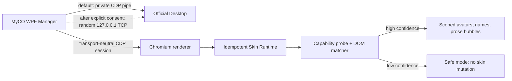
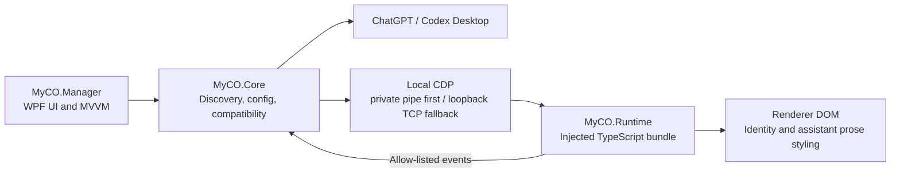

# It's MyCO!!!!!


[Simplified Chinese](README.md)

## Overview

MyCO is a lightweight, open-source Codex interface-customization tool. Launch
Codex through MyCO to personalize the Assistant avatar, nickname, chat bubbles,
and bubble colors for a more immersive conversation experience. ～(∠・ω< )⌒★

MyCO can launch Codex as an associated application. Once the initial setup is
complete, every Codex launch automatically loads your saved character profile
and interface settings—no repeated restart cycle is needed.

The launcher includes position calibration and palette controls. If an avatar,
nickname, or bubble is misplaced, calibration can rematch its display position;
the palette lets you freely adjust chat-bubble colors.

MyCO also offers optional smart bubble splitting, which divides long replies
into naturally sized consecutive bubbles for a more authentic instant-messaging
feel.

**Tip: pairing MyCO with a distilled-character skill can produce unexpectedly delightful results. ο(=•ω＜=)ρ⌒☆**

## Screenshots


## Features

- Assistant/User avatars and nicknames
- Center-cropped circular avatars by default
- Instant, persistent English, Simplified Chinese, and Traditional Chinese UI
  switching
- Assistant bubbles automatically follow Codex's light/dark theme and retain
  independent two-palette settings
- Automatic split bubbles or one complete-response bubble, persisted and
  applied immediately
- Native Codex User bubbles remain supported
- Structural-signature and confidence-based Assistant/User role recognition
- Manual message-container calibration
- Reliable `destroy()` on exit restores the official DOM/CSS
- Local redacted diagnostics and zero telemetry

## How it works



The manager discovers supported installed applications, asks for a normal
restart when an already-running app has no debugging endpoint, and launches the
official executable through a private inherited pipe. It scores renderer
targets by URL, type, title, and DOM capabilities; injects the bundled runtime;
then checks a versioned protocol handshake.

The runtime never receives host privileges. Its randomly named bridge can only
send whitelisted calibration, readiness, diagnostics, compatibility, and error
events back to the manager.

## Installation

Requirements:

- Windows 10/11 x64
- An official Codex / ChatGPT Desktop installation

Download `MyCO-win-x64.zip` from GitHub Releases, extract it to a writable
folder, and run `MyCO.exe`. The release is self-contained; .NET, Node.js,
npm, and Visual Studio are not required.

MyCO-owned binaries in release `0.99.0` carry Authenticode SHA-256 signatures
and timestamps under the self-signed `CN=Crikok` certificate. This certificate
is not rooted in the Windows public trust store, so Windows may still show an
unknown-publisher or reputation warning. Verify the release SHA-256, public
certificate, SBOM, and GitHub provenance attestation as described in the
[code signing policy](security/CODE_SIGNING.md).

When upgrading from the pre-rename build, MyCO copies `%APPDATA%\MyCodex` to
`%APPDATA%\Myco` only when the new directory does not exist. It never deletes
the legacy directory or overwrites existing MyCO data. The old per-user login
startup values named `MyCodex` or `Myco` are migrated to `MyCO` during
settings reconciliation.

## First setup

1. Start MyCO and complete the local-only introduction.
2. Confirm the detected official Desktop installation.
3. Select **Start Codex with MyCO**.
4. If Desktop is already running, allow a normal restart. If its window closes
   but the app remains in the tray, MyCO keeps tracking the exact pre-close
   PID, path, and start time before offering a separately confirmed tree
   termination. Multiple roots or uncertain identity fail closed. MyCO then
   waits for stable resource release, launches Codex, waits for renderer
   readiness, and applies the Runtime without a second click.
5. Open a conversation. If automatic matching is not confident, complete both
   calibration steps.

The default pipe mode opens no TCP listener. If the pipe fails, MyCO asks
before using a new `127.0.0.1`-only TCP port for that session.

## Customization

Choose **English**, **简体中文**, or **繁體中文** from the sidebar language
selector. The change is immediate and saved independently, so unsaved appearance
edits are not affected. The same selector is available during first-run setup.

The Appearance page selects Automatic grouping or Whole response and controls
names, avatars, avatar size, symmetric horizontal
avatar position, shared vertical avatar position, assistant bubble radius,
horizontal and vertical padding, message gap, maximum width, nickname
visibility, and separate Dark/Light bubble, text, nickname, and avatar colors.
Assistant text/background contrast is validated at 4.5:1. The bubble theme
always follows the Codex renderer and is independent of the Manager theme.
Image imports accept PNG, JPEG, GIF, and BMP files up to 10 MiB.
Files are signature-checked, copied to the local avatar directory under a
content-hash filename, and sent to the runtime as a data URL.

**Save & apply** writes the configuration atomically and updates connected
renderers without a page reload. **Disable skin** calls runtime cleanup and
restores the original DOM/CSS without closing Desktop.

Settings provides Manager Dark, Light, and Windows System modes plus independent
options to start MyCO at Windows sign-in and to start Codex after MyCO
starts. Per-user startup uses `HKCU\...\Run` with `--background`, requires no
administrator rights, and corrects path drift after moving a release. MyCO
does not modify official shortcuts, protocol associations, or installation
files. Close offers Exit MyCO, Minimize to tray, or Cancel. Exit releases
only MyCO resources and leaves Codex running. See [Settings](docs/settings.md).

## Calibration

Calibration stores structural signatures, never message text.

1. Choose **Calibrate assistant**, move over a normal assistant response until
   the intended turn is highlighted, then click it.
2. Choose **Calibrate user** and click a normal user message.
3. Press Escape at any time to cancel. Re-run either step to replace a mistaken
   signature.

Selection uses the event composed path and searches upward for a semantic turn
root. Signatures contain stable attributes, ancestor structure, child-tag
shape, layout ratios, and capabilities. They are schema-versioned in
`calibration.json`.

## Compatibility

Compatibility is based on capabilities and confidence, not a hard-coded
application version. Application adapters, the injection backend, DOM matching,
and the skin engine are separate components. Generated/minified class tokens
are filtered out.

- **Compatible**: both roles match with strong confidence; skin is enabled.
- **Degraded**: structure still matches but recalibration is recommended.
- **Safe mode**: the page is unknown; MyCO performs no skin mutation.
- **Injection unavailable**: CDP cannot be reached; official files are never
  patched as a fallback.

See [Compatibility architecture](docs/compatibility.md).

## Update compatibility

Desktop updates are handled in three layers:

1. **Automatic compatibility detection** refreshes the current Store package
   entry before every managed launch, re-probes the renderer, prefers current
   stable semantic/structural turns, and then uses saved structural signatures
   as a fallback. Runtime and stylesheet health are rechecked while connected.
2. **Recalibration** repairs expected wrapper, attribute, layout, or generated
   class changes without losing appearance settings or the older profile.
3. **A new MyCO release** is required if the application changes the
   injection boundary or substantially restructures the renderer.

MyCO does not claim permanent compatibility with every future Codex or
ChatGPT Desktop release.

## Diagnostics

The Diagnostics page reports manager/runtime protocol versions, application
candidate metadata, CDP target counts, compatibility state, match counts,
confidence, observer state, and error codes. It omits message text, prompts,
code, tokens, cookies, authorization data, account details, and unnecessary
paths.

Logs are written locally under `%APPDATA%\Myco\logs`. Attach only diagnostics
you have reviewed when opening an issue.

## Privacy

MyCO runs locally, requires no OpenAI credentials, uploads no conversations,
does not read authentication cookies, does not intercept network requests, and
contains no analytics or telemetry. Configuration is stored under
`%APPDATA%\Myco`.

Read [PRIVACY.md](PRIVACY.md) and [SECURITY.md](SECURITY.md).

## Known limitations

- The Windows x64 package uses a separate self-signed certificate for each
  release; it has no public-CA trust or cross-version publisher reputation.
- An official Desktop restart is required when it was started without CDP.
- DOM updates can require recalibration; a major update can require a new
  MyCO release.
- Calibration is per local configuration and currently targets the visible
  renderer.
- Windows ARM64, Windows 10 22H2, every DPI/language combination, and contrast
  themes were not all exercised on this development machine; see the
  [support matrix](docs/compatibility.md).
- Signed-in real-conversation behavior varies by Desktop version; safe mode is
  intentionally conservative.

## Repository architecture

MyCO has a native manager and a small browser runtime. The manager owns
configuration and process/session lifecycle; the runtime owns reversible DOM
decoration inside the selected renderer.



```text
.
├─ src/
│  ├─ MyCO.Manager/       WPF application, localization, pages, and view model
│  ├─ MyCO.Core/          application discovery, config, CDP, injection, safety
│  └─ MyCO.Runtime/
│     ├─ src/                hand-written TypeScript runtime
│     ├─ tests/              jsdom behavior and compatibility tests
│     └─ dist/               generated bundle embedded in the WPF executable
├─ tests/MyCO.Tests/      xUnit tests for Core and localization
├─ tools/MyCO.CdpProbe/   isolated end-to-end CDP/runtime feasibility gate
├─ scripts/                  reproducible release build
├─ docs/                     detailed architecture and compatibility notes
├─ assets/                   project-owned visual assets
└─ .github/workflows/        Windows build, test, publish, and artifact upload
```

The main execution path is:

1. `MyCO.Manager` loads `%APPDATA%\Myco\config.json` and discovers
   supported desktop installations through `MyCO.Core`.
2. The selected desktop is launched through a private CDP pipe; loopback TCP
   is used only after explicit confirmation.
3. Core ranks renderer targets, injects the generated Runtime bundle, and
   verifies a protocol handshake.
4. Runtime classifies message turns, decorates safe prose/identity surfaces,
   observes DOM changes, and reports only allow-listed technical events.
5. Core monitors renderer health and reinjects after navigation or renderer
   replacement when required.

## Before development

Install and verify:

- Windows 10/11 x64. WPF projects cannot be built on a non-Windows host.
- [.NET 8 SDK](https://dotnet.microsoft.com/download/dotnet/8.0), not only the
  .NET Desktop Runtime. Confirm with `dotnet --list-sdks`.
- Node.js 22 LTS with npm. Node.js 20 or newer is supported; CI currently uses
  Node.js 22.
- PowerShell 7 is recommended for the release script.
- Git is required for contribution; GitHub CLI is optional for PR/Actions work.

Important rules before changing code:

- Run commands from the repository root unless a command explicitly changes to
  `src/MyCO.Runtime`.
- Edit `src/MyCO.Runtime/src`, never the minified
  `dist/MyCO.runtime.js` directly. Run `npm run build` and commit the updated
  generated bundle with Runtime changes.
- Build the Runtime before the WPF project. The WPF project embeds the current
  `dist/MyCO.runtime.js`; MSBuild does not generate it automatically.
- Change release/protocol/schema values only in `eng/MyCO.Version.props`;
  C#, the TypeScript bundle, UI, and release artifacts consume that source.
- Keep every localization `x:Key` identical in `Strings.en-US.xaml`,
  `Strings.zh-CN.xaml`, and `Strings.zh-TW.xaml`.
- User config, avatars, logs, calibration data, and backups belong under
  `%APPDATA%\Myco`, never in the repository.
- Do not commit official OpenAI binaries, bundles, DOM snapshots, icons,
  source, credentials, or real conversation data. Compatibility fixtures must
  be synthetic.
- CDP must remain private-pipe first. TCP is an explicitly approved fallback
  and must bind only to `127.0.0.1`, never a LAN interface.
- Classification and calibration changes must remain fail-closed: uncertain
  elements stay native rather than receiving a guessed role.

## Development workflow

For a normal change:

1. Update the smallest owning project: Core, Manager, or Runtime.
2. If Runtime changed, run `npm run check` before building .NET.
3. Run the xUnit suite for Core/Manager behavior.
4. Use `MyCO.CdpProbe` for changes to application discovery, injection,
   renderer recovery, or DOM compatibility.
5. Run the release script before publishing a user-facing build.

## Build

```powershell
cd src\MyCO.Runtime
npm ci
npm run check
cd ..\..
dotnet restore MyCO.sln
dotnet build MyCO.sln -c Release --no-restore
dotnet test MyCO.sln -c Release --no-build
dotnet publish src\MyCO.Manager\MyCO.Manager.csproj `
  -c Release -r win-x64 --self-contained true
```

To create the same zip as CI:

```powershell
.\scripts\build-release.ps1
```

For a slow proxy or mainland-China network, the script also supports:

```powershell
.\scripts\build-release.ps1 -UseChinaMirrors
```

That switch selects npm's npmmirror registry and Huawei Cloud's NuGet mirror
for the current build only; it does not alter global package-manager settings
or store regional mirror URLs in the repository lockfile.

## Contributing

Read [CONTRIBUTING.md](CONTRIBUTING.md). Compatibility fixtures must be
synthetic and tests must never include real Desktop DOM snapshots or chat data.

## License

[MIT](LICENSE), copyright © 2026 Crikok.

## Disclaimer

MyCO is an independent open-source project. It is not affiliated with,
endorsed by, or sponsored by OpenAI. It requires an official Codex / ChatGPT
Desktop installation and does not redistribute any part of that application.

MyCO does not provide, host, package, modify, crack, or distribute installation
packages, source code, binaries, resource files, or any components of Codex,
ChatGPT Desktop, or other OpenAI software. Users must download and install
official software through OpenAI's official channels and comply with the latest
OpenAI terms, software licenses, and applicable local laws. This project is not
intended for reverse engineering, theft, copying, or bypassing account,
subscription, usage, security, access-control, or other platform restrictions.

Because the official desktop client may change at any time, MyCO does not
guarantee permanent compatibility, continuous availability, or absolute
stability. Any loss caused by software updates, system environments,
third-party dependencies, user configuration, or improper operation is the
user's responsibility.

The names, avatars, conversations, and data shown in screenshots are fictional
examples for demonstration only. Project icons and some visual assets may be
AI-generated or AI-assisted; they are not intended to depict real people or to
imitate or infringe any third-party copyright, trademark, portrait, or other
rights. If you believe an asset is infringing or misleading, please contact the
maintainer with the relevant location, proof of rights, and requested remedy.

**By downloading, installing, copying, modifying, or using MyCO, you confirm
that you have read, understood, and accepted this entire disclaimer.**

## A final note

MyCO began after an argument with my partner. She was gentle rather than angry,
but I still could not find a good way to comfort her. I distilled hundreds of
thousands of our chat messages into skills so I could repeatedly explore how to
respond more thoughtfully.

Those skills came surprisingly close to her voice, but something still felt
missing. That led to MyCO: giving Codex an avatar and nickname made the
experience feel much more present.

The original approach was very different. To avoid breakage from official
updates, version one used transparent display rather than modifying injection,
but it was neither usable nor responsive enough. The current front-end injection
approach works much better, with one important caveat: any official Codex update
can break it. MyCO therefore cannot promise permanent stability. ≧ ﹏ ≦

The project was initially called MyCodex, simply meaning a customized Codex,
but GitHub already had many projects with that name. Removing a few letters
produced MyCO. The name, icon, and the fictional “Feiyezi” shown in the
screenshots all grew from that same spontaneous idea.

MyCO is still an immature project with plenty to improve. Contributions, issue
reports, and maintenance help are sincerely welcome. Thank you for using and
contributing to MyCO!
