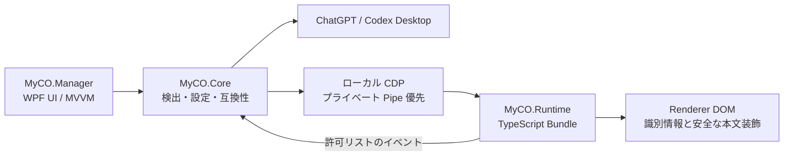

# It's MyCO!!!!!


[简体中文](README.md) | [English](README.en-US.md)

## 概要

MyCO は、Codex の画面を自分らしく整えるための軽量なオープンソースツールです。
MyCO から Codex を起動すると、アシスタントとユーザーのアバター、表示名、
チャットの吹き出し、配色をローカルで変更できます。

標準のコード、Diff、ツール、承認、入力欄、ツールバーはそのまま保ち、確認できた
会話本文だけを装飾します。位置がずれた場合は、本文を保存しない構造調整で再認識できます。

## 主な機能

- アシスタント / ユーザーのアバターと表示名
- 中央切り抜きの円形アバター
- English、简体中文、繁體中文、日本語の即時切り替えと保存
- Codex のライト / ダークテーマに追従する独立した吹き出し配色
- Markdown 構造に沿った自動グループ化、または返信全体の吹き出し表示
- 同じ論理ターン内にある複数の独立した進捗メッセージにも、それぞれ一組の表示名とアバター
- 構造シグネチャと信頼度に基づく Fail-Closed の役割判定
- `destroy()` による完全な DOM / CSS 復元
- ローカルの匿名化診断、テレメトリなし

## インストール

必要な環境:

- Windows 10 / 11 x64
- 公式の Codex / ChatGPT Desktop

GitHub Releases から `MyCO-win-x64.zip` をダウンロードし、書き込み可能な
フォルダーに展開して `MyCO.exe` を実行します。配布パッケージは self-contained
なので、.NET Runtime、Node.js、npm、Visual Studio を別途インストールする必要はありません。

`0.99.0` の MyCO バイナリは、自己署名証明書 `CN=Crikok` による Authenticode
SHA-256 署名を使用します。この証明書は Windows の公開信頼チェーンに含まれず、
公開タイムスタンプにも依存しません。そのため SmartScreen が警告を表示する場合があります。
Release の SHA-256、公開証明書、SBOM、GitHub provenance も併せて確認してください。
詳細は[コード署名ポリシー](security/CODE_SIGNING.md)を参照してください。

旧ブランド版から移行する場合、`%APPDATA%\Myco` が存在しないときだけ
`%APPDATA%\MyCodex` を安全にコピーします。旧フォルダーは削除せず、既存の
MyCO データを上書きしません。

## 初回設定

1. MyCO を起動し、ローカルのみで表示される案内を確認します。
2. 検出された公式 Desktop アプリを確認します。
3. **MyCO で Codex を起動** を選びます。
4. Codex がすでに実行中なら、通常終了による再起動を許可します。MyCO は PID、
   実行パス、開始時刻を再確認し、識別できないプロセスを終了しません。
5. 会話を開き、自動認識の信頼度が不足する場合はアシスタントとユーザーを各 3 件調整します。

既定では TCP ポートを開かず、親子プロセスだけが保持するプライベート CDP Pipe を使います。
Pipe を利用できない場合に限り、ユーザーが明示的に許可したそのセッションだけ、
ランダムな `127.0.0.1` ポートを使用します。

## カスタマイズ

サイドバーまたは初回案内で **日本語** を選ぶと、表示がすぐに切り替わり、
外観の未保存変更とは独立して保存されます。

「外観」では表示名、アバター、サイズ、位置、吹き出しの丸み、上下左右の余白、
メッセージ間隔、最大幅、表示名の有無、ライト / ダークの配色を設定できます。
文字と背景は 4.5:1 以上のコントラストを検証します。画像は PNG、JPEG、GIF、BMP、
最大 10 MiB に対応し、実際のファイルシグネチャを確認してから管理フォルダーへコピーします。

**保存して適用** は設定を原子的に保存し、接続済みレンダラーへすぐ反映します。
**スキンを無効にする** は Runtime を破棄して公式画面を復元しますが、Codex は終了しません。

「設定」では Manager のダーク / ライト / Windows 追従、Windows サインイン時の
MyCO 起動、MyCO 起動後の Codex 起動を選べます。赤い **既定に戻す** は確認後、
Runtime と MyCO のログイン時起動項目を安全に外し、`%APPDATA%\Myco` 内の設定、
調整、管理対象アバター、ログ、バックアップだけを初回状態へ戻します。MyCO の
インストール、旧版の移行元、Codex、ユーザープロファイル、チャット、認証情報は削除しません。

## 調整

調整は会話本文を保存せず、テキストを含まない構造シグネチャだけを保存します。

1. **アシスタントを調整** を選び、内容の異なる通常返信を 3 件クリックします。
2. **ユーザーを調整** を選び、異なる通常メッセージを 3 件クリックします。
3. Escape で設定を変えずに中止できます。

コード、Diff、ツール、状態表示、ツールバー、操作部品、エディター、入力欄は拒否されます。
確信できない要素は装飾しません。

## プライバシーと診断

MyCO はローカルで動作し、OpenAI の認証情報を要求せず、会話をアップロードせず、
認証 Cookie を読み取らず、通信を傍受しません。Analytics、Sentry、その他の
テレメトリもありません。設定と匿名化ログは `%APPDATA%\Myco` に保存されます。

診断には Manager / Runtime のバージョン、候補アプリの技術情報、レンダラー数、
互換状態、件数、平均信頼度、Observer 状態、エラーコードだけが含まれます。
メッセージ本文、Prompt、コード、Token、Cookie、Authorization、アカウント情報は含みません。

[PRIVACY.md](PRIVACY.md) と [SECURITY.md](SECURITY.md) も確認してください。

## 既知の制限

- 公式 Desktop を CDP なしで起動している場合、一度だけ通常再起動が必要です。
- Desktop の DOM 更新後は再調整が必要になる場合があります。大きな変更には MyCO の更新が必要です。
- Windows ARM64、Windows 10 22H2、すべての DPI / 言語 / 高コントラストの組み合わせは、
  今回の開発環境ですべて実機確認したわけではありません。
- 実際のサインイン済み会話構造は Desktop の版によって異なるため、Safe Mode は意図的に保守的です。

## アーキテクチャ



Manager は設定、プロセス、セッションのライフサイクルを管理します。Runtime は、
選択されたレンダラー内で元に戻せる DOM 装飾だけを担当し、ホスト権限、シェル、
ファイル操作、任意のネットワーク機能を持ちません。

## 開発

必要なもの:

- Windows 10 / 11 x64
- .NET 8 SDK
- Node.js 20 以上（CI は Node.js 22）と npm

Runtime のソースは `src/MyCO.Runtime/src` だけを編集してください。
`src/MyCO.Runtime/dist/MyCO.runtime.js` は生成物なので手作業で変更しません。
4 言語の `Strings.en-US.xaml`、`Strings.zh-CN.xaml`、`Strings.zh-TW.xaml`、
`Strings.ja-JP.xaml` はすべて同じ `x:Key` を持つ必要があります。

```powershell
Push-Location .\src\MyCO.Runtime
npm.cmd ci
npm.cmd run check
Pop-Location
dotnet build .\MyCO.sln -c Release
dotnet test .\MyCO.sln -c Release --no-build
```

## ライセンスと免責事項

[MIT](LICENSE)、Copyright © 2026 Crikok。

MyCO は独立した第三者のオープンソースプロジェクトです。OpenAI との提携、承認、
後援関係はなく、公式 Codex / ChatGPT Desktop のインストールが必要です。
公式ソフトウェアのインストーラー、ソース、バイナリ、リソースを提供、改変、配布せず、
認証、契約、使用量、安全機構、アクセス制御を回避する機能も提供しません。

公式クライアントはいつでも変更される可能性があり、永続的な互換性、継続利用、
完全な安定性は保証できません。ダウンロード、インストール、複製、変更、または
使用した時点で、この説明と免責事項を読んで同意したものとみなされます。

私は、愛はアルゴリズムを越えられると信じています。
