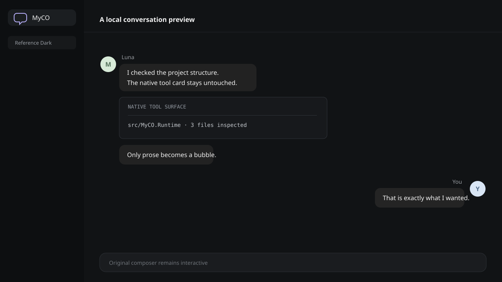
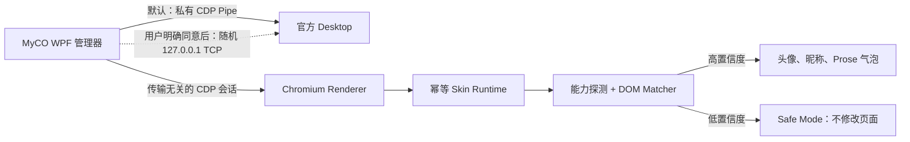
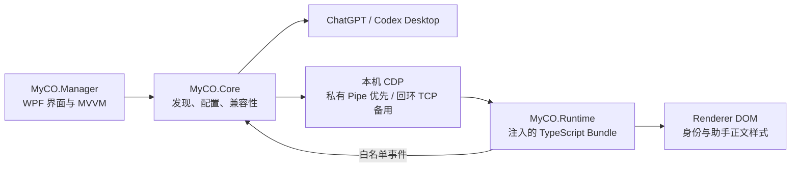

# MyCO

> It's MyCO!!!!!

MyCO `0.3.0-beta.1` 是一个本地 Windows 管理器，为官方 Codex /
ChatGPT Desktop 对话界面增加可自定义的 Assistant/User 头像和昵称，并仅为
Assistant 正文增加紧凑气泡；User 继续使用官方原生气泡。

它由独立 GUI 管理器、CDP Runtime Injector 和 DOM Skin Engine 组成；它不是
Overlay、OCR 重绘、DLL 注入、浏览器扩展、API 客户端，也不会修改 `app.asar`。

[English](README.en-US.md)

## 概览

MyCO 只调整对话消息区域。Assistant 左对齐，User 右对齐；Assistant 的普通
prose/Markdown 文本进入气泡，代码块、Diff、Tool Card、处理状态、操作按钮和
输入框继续使用官方原生 UI。User 气泡的背景、圆角、内边距、宽度和位置完全保留。

## 截图



这是项目自行绘制的合成预览，不包含 OpenAI 素材、应用 Bundle 或真实聊天数据。

## 功能

- Assistant/User 头像与昵称
- 头像默认使用居中裁剪的圆形显示
- English、简体中文、繁體中文界面即时切换并持久化
- Assistant 气泡自动跟随当前 Codex Renderer 深浅主题，独立保存双调色板
- Manager 可强制深色、浅色或实时跟随 Windows
- 最小化到托盘、托盘恢复与隐藏实例再次启动激活
- 正式多尺寸应用图标统一用于窗口、任务栏、Alt+Tab、托盘和发行 EXE
- 关闭窗口时可选择退出 MyCO、最小化到托盘或取消；退出不会关闭 Codex
- 一键安全重启会等待旧进程树稳定退出、等待新 Renderer 就绪并自动应用 Runtime
- Assistant 气泡可选“自动切割气泡”或“整段完整气泡”，设置持久化并即时应用
- 可选登录 Windows 后后台启动 MyCO，以及启动 MyCO 后安全启动 Codex
- User 原生气泡不改色、不改尺寸、不改 padding、不改位置
- 基于结构签名和置信度的 User/Assistant Turn 识别
- 过滤随机/压缩 class，适应轻中度 DOM 更新
- 手动校准、Hover 高亮、Escape 取消和重新校准
- 兼容性检测、降级状态与 Fail-closed Safe Mode
- 配置即时应用、Runtime/样式健康检查、SPA 根节点自愈和 Target 重建后自动重注入
- Disable/退出时可靠 `destroy()`，恢复官方 DOM/CSS
- 本地脱敏诊断、零遥测

## 工作原理



管理器发现官方安装，默认通过仅由父子进程持有的私有 Pipe 启动应用，结合 URL、
类型、标题和 DOM 能力选择 Renderer，注入内置 Runtime 并完成版本化协议握手。
只有 Pipe 不可用且用户明确同意时，才为本次会话改用随机 `127.0.0.1` TCP 端口。Runtime 不拥有宿主
权限；随机命名的 Binding 只能向管理器发送白名单事件，不能执行 Shell、读文件或
发起任意网络请求。

## 安装

要求：

- Windows 10/11 x64
- 已安装官方 Codex / ChatGPT Desktop

从 GitHub Releases 下载 `MyCO-win-x64.zip`，解压到可写目录，运行
`MyCO.exe`。发行包为 self-contained，无需另装 .NET Runtime、Node、npm
或 Visual Studio。

Alpha 版本暂未签名，Windows 可能显示信誉提示；请先核对发布源码与校验值。

从旧品牌版本升级时，MyCO 首次启动会在 `%APPDATA%\Myco` 尚不存在的前提下，
将 `%APPDATA%\MyCodex` 安全复制到新目录；旧目录不会被删除，已有 MyCO 数据也
不会被覆盖。原有 `MyCodex` 或 `Myco` 登录启动项会在设置同步时迁移为
`MyCO`。

## 首次设置

1. 启动 MyCO，完成仅本地的首次说明。
2. 确认检测到的官方 Desktop。
3. 点击 **Start Codex with MyCO**。
4. 若官方应用已经运行，同意先正常重启。若窗口关闭后应用仍驻留托盘，MyCO 会继续
   跟踪关闭前记录的精确 PID、路径和启动时间，并二次确认是否强制结束该进程树；
   多个根进程或身份不确定时会拒绝操作。旧进程树稳定释放后，MyCO 会自动启动、
   等待 Renderer 就绪并应用功能，不需要第二次点击。
5. 打开一个对话；若自动识别置信度不足，完成 Assistant 与 User 两步校准。

默认 Pipe 模式不监听 TCP；显式备用模式仅绑定 `127.0.0.1` 并为每次会话选择新端口。

## 自定义

可在侧边栏的“界面语言”中选择 **English**、**简体中文** 或 **繁體中文**。
切换立即生效并独立保存，不会覆盖尚未保存的外观编辑；首次启动引导中也提供同一选项。

Appearance 页面支持“自动切割气泡”和“整段完整气泡”、昵称、头像、头像尺寸、
头像水平/垂直位置、Assistant 气泡圆角、
横纵 padding、消息间距、最大宽度、昵称显示开关，以及经 4.5:1 对比度校验的
Dark/Light 两套气泡、文字、昵称和头像颜色。气泡主题只跟随 Codex Renderer，
不受 Manager 主题设置影响。头像支持 PNG/JPEG/GIF/BMP，
最大 10 MiB；文件会校验真实
签名，以内容哈希命名并复制到本地头像目录，再以 data URL 传给 Runtime。

**Save & apply** 会原子保存配置并即时更新已连接 Renderer。**Disable skin**
会调用 Runtime 清理并恢复官方界面，不关闭 Desktop。

设置页可选择 Manager 的深色、浅色或跟随 Windows，并分别开启“登录 Windows
时启动 MyCO”和“MyCO 启动后启动 Codex”。登录启动使用当前用户的
`HKCU\...\Run`，以 `--background` 进入托盘，不需要管理员权限；移动发行目录后
会纠正路径漂移。MyCO 不修改官方快捷方式、协议关联或官方安装目录。点击关闭
按钮可选择退出 MyCO、最小化到托盘或取消；退出只释放 MyCO 资源，Codex
继续运行。详见[设置说明](docs/settings.md)。

## 校准

校准只保存结构签名，不保存聊天正文。

1. 点击 **Calibrate assistant**，在官方窗口中移动鼠标，目标 Turn 高亮后点击。
2. 点击 **Calibrate user**，选择一条普通 User 消息。
3. 按 Escape 可取消；重新执行某一步即可覆盖误选结果。

选择器使用 `event.composedPath()` 向父层寻找语义 Turn Root。签名包含稳定属性、
祖先结构、子标签形状、布局比例和能力，并以版本化 `calibration.json` 保存。

## 兼容性

兼容性依据实际能力和置信度，而非硬编码应用版本。Application Adapter、Injection
Backend、DOM Matcher 与 Skin Engine 彼此独立。

- **Compatible**：两类消息高置信度匹配，启用皮肤。
- **Degraded**：仍可匹配，但建议重新校准。
- **Safe Mode**：页面结构未知，不进行皮肤 DOM Mutation。
- **Injection unavailable**：CDP 不可用；绝不会转而修改官方文件。

详见 [兼容性架构](docs/compatibility.md)。

## 更新兼容

官方 Desktop 更新后按三级机制恢复：

1. **自动兼容检测**：每次托管启动前刷新当前 Store 包入口，再探测 Renderer；
   优先识别当前稳定语义/结构 Turn，旧校准签名只作为后备。连接期间会持续检查
   Runtime、样式与 Observer 健康状态。
2. **重新校准**：修复 wrapper、属性、布局或随机 class 变化，不清空外观设置和旧配置。
3. **发布新版 MyCO**：若注入边界改变或 Renderer 大规模重构，需要更新 Backend
   或 DOM Adapter。

项目不会宣称永久兼容未来所有 Codex / ChatGPT Desktop 版本。

## 诊断

Diagnostics 页面只输出 Manager/Runtime 协议版本、候选应用元数据、CDP Target
数量、兼容状态、匹配数量、平均置信度、Observer 状态和错误代码。它不会输出消息
正文、Prompt、代码、Token、Cookie、Authorization、账户资料或不必要路径。

日志位于 `%APPDATA%\Myco\logs`。提交 Issue 前请自行检查要附加的诊断内容。

## 隐私

MyCO 完全本地运行，不要求 OpenAI 凭据，不上传对话，不读取认证 Cookie，不
拦截网络请求，也没有 Analytics、Sentry 或任何遥测。配置保存在
`%APPDATA%\Myco`。

请阅读 [PRIVACY.md](PRIVACY.md) 与 [SECURITY.md](SECURITY.md)。

## 已知限制

- 当前为未签名的 Windows x64 Beta 版本。
- 官方应用若未以 CDP 参数启动，需要正常重启一次。
- DOM 更新可能要求重新校准；大改版可能要求新的 MyCO 版本。
- 校准属于本地配置，当前针对可见 Renderer。
- Windows ARM64、Windows 10 22H2、全部 DPI/语言及高对比度组合尚未在本轮
  开发机上逐项实机验证，详见[兼容性矩阵](docs/compatibility.md)。
- 不同官方版本的已登录真实对话结构会有差异，Safe Mode 因此刻意保守。

## 仓库架构

MyCO 由原生管理器和一个小型浏览器 Runtime 组成。管理器负责配置、进程与
会话生命周期；Runtime 只负责在选中的 Renderer 内进行可撤销的 DOM 装饰。



```text
.
├─ src/
│  ├─ MyCO.Manager/       WPF 应用、本地化、页面与 ViewModel
│  ├─ MyCO.Core/          应用发现、配置、CDP、注入与安全边界
│  └─ MyCO.Runtime/
│     ├─ src/                手写 TypeScript Runtime
│     ├─ tests/              jsdom 行为与兼容性测试
│     └─ dist/               生成后嵌入 WPF 程序的 Bundle
├─ tests/MyCO.Tests/      Core 与本地化的 xUnit 测试
├─ tools/MyCO.CdpProbe/   隔离的 CDP/Runtime 端到端可行性门禁
├─ scripts/                  可复现的发行构建脚本
├─ docs/                     详细架构与兼容性说明
├─ assets/                   项目自有视觉资源
└─ .github/workflows/        Windows 构建、测试、发布与制品上传
```

主要执行流程：

1. `MyCO.Manager` 读取 `%APPDATA%\Myco\config.json`，并通过
   `MyCO.Core` 查找支持的 Desktop 安装。
2. 优先使用私有 CDP Pipe 启动所选 Desktop；只有用户确认后才使用回环 TCP 备用。
3. Core 对 Renderer 进行评分，注入生成后的 Runtime Bundle，并验证协议握手。
4. Runtime 识别消息、装饰安全的正文与身份区域、监听 DOM 更新，只上报白名单
   技术事件。
5. Core 持续检查 Renderer 健康状态，并在导航或 Renderer 被替换后按需重新注入。

## 开发前须知

请先安装并确认：

- Windows 10/11 x64；WPF 项目不能在非 Windows 主机上构建。
- [.NET 8 SDK](https://dotnet.microsoft.com/download/dotnet/8.0)，仅安装
  .NET Desktop Runtime 不够。使用 `dotnet --list-sdks` 检查。
- Node.js 22 LTS 与 npm。最低支持 Node.js 20，CI 当前使用 Node.js 22。
- 推荐 PowerShell 7，用于执行发行构建脚本。
- 参与贡献需要 Git；处理 PR 或 Actions 时可选安装 GitHub CLI。

修改代码前必须了解：

- 除非命令明确进入 `src/MyCO.Runtime`，否则均从仓库根目录执行。
- 只编辑 `src/MyCO.Runtime/src`，不要直接修改压缩后的
  `dist/MyCO.runtime.js`。Runtime 变更后运行 `npm run build`，并一同提交
  更新后的 Bundle。
- 先构建 Runtime，再构建 WPF。WPF 项目会嵌入当前的
  `dist/MyCO.runtime.js`，MSBuild 不会自动生成它。
- 修改 Host/Runtime 通信时，只在 `eng/MyCO.Version.props` 更新版本和 Schema；
  C#、TypeScript Bundle、界面与发行包均从该文件生成或读取。
- `Strings.en-US.xaml`、`Strings.zh-CN.xaml` 和 `Strings.zh-TW.xaml` 的全部
  `x:Key` 必须保持一致。
- 用户配置、头像、日志、校准数据与备份只能放在 `%APPDATA%\Myco`，不得放入
  仓库。
- 禁止提交 OpenAI 官方二进制、Bundle、真实 DOM Snapshot、图标、源码、凭据或
  用户聊天数据；兼容性 Fixture 必须人工合成。
- CDP 必须保持私有 Pipe 优先；TCP 只能作为用户明确同意的备用方式，并且必须仅
  绑定 `127.0.0.1`，不得向局域网暴露调试端口。
- 分类与校准必须保持 Fail-Closed：无法确定角色的元素应保留原生外观，不能猜测。

## 开发流程

常规修改建议依次执行：

1. 只修改负责该功能的最小项目：Core、Manager 或 Runtime。
2. Runtime 有变更时，先运行 `npm run check`，再构建 .NET。
3. 运行 xUnit，验证 Core 与 Manager 行为。
4. 修改应用发现、注入、Renderer 恢复或 DOM 兼容性时，运行
   `MyCO.CdpProbe`。
5. 发布用户版本前运行发行构建脚本。

## 构建

```powershell
cd src\MyCO.Runtime
npm ci
npm run check
cd ..\..
dotnet restore MyCO.sln
dotnet build MyCO.sln -c Release --no-restore
dotnet test MyCO.sln -c Release --no-build
dotnet publish src\MyCO.Manager\MyCO.Manager.csproj `
  -c Release -r win-x64 --self-contained true
```

生成与 CI 一致的发行包：

```powershell
.\scripts\build-release.ps1
```

如代理较慢或使用中国大陆网络，可仅对本次构建启用国内镜像：

```powershell
.\scripts\build-release.ps1 -UseChinaMirrors
```

该开关使用 npmmirror 与华为云 NuGet 镜像，不修改全局包管理器设置，也不会把
地域镜像地址写入仓库的 lockfile。

## 参与贡献

请阅读 [CONTRIBUTING.md](CONTRIBUTING.md)。兼容性 Fixture 必须自行合成，禁止
提交官方真实 DOM Snapshot 或聊天数据。

## 许可证

[MIT](LICENSE)，Copyright © 2026 MyCO Contributors。

## 免责声明

MyCO 是独立开源项目，与 OpenAI 无隶属、认可或赞助关系。项目要求用户自行安装
官方 Codex / ChatGPT Desktop，且不分发该应用的任何组成部分。
