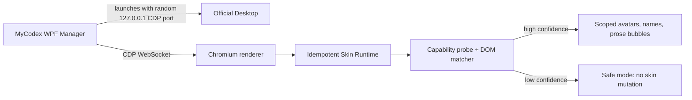

# MyCodex

MyCodex `0.1.1-alpha` is a local Windows manager that adds custom assistant and
user avatars and nicknames plus compact assistant prose bubbles to the official
Codex / ChatGPT Desktop conversation view. Official user bubbles stay native.

It is an independent GUI manager, CDP runtime injector, and DOM skin engine.
It is not an overlay, OCR renderer, DLL injector, browser extension, API
client, or `app.asar` patch.

[简体中文](README.zh-CN.md)

## Screenshot


This is a project-owned synthetic preview. It contains no OpenAI assets,
application bundle, or conversation data.

## Features

- Assistant and user avatars and nicknames
- Circular, center-cropped avatars by default
- Instant, persisted English, Simplified Chinese, and Traditional Chinese UI
- Parameterized Reference Dark assistant bubbles with compact short messages
- Left-aligned assistant and right-aligned user layout
- Prose-only assistant bubbles: code, diffs, tool cards, status, toolbars, and
  native controls remain under the official UI
- Native user bubbles are never recolored, resized, padded, or repositioned
- Manual structural calibration with hover highlighting and Escape-to-cancel
- Confidence-based matching that ignores generated CSS class hashes
- Compatibility probe, degraded mode, and fail-closed safe mode
- Live configuration updates over CDP
- Runtime/style health checks, SPA-root self-healing, automatic target
  reinjection, and reliable disable/destroy cleanup
- Privacy-safe diagnostics, local-only settings, and zero telemetry

## How it works



The manager discovers supported installed applications, asks for a normal
restart when an already-running app has no debugging endpoint, and launches the
official executable with a random loopback-only port. It scores renderer
targets by URL, type, title, and DOM capabilities; injects the bundled runtime;
then checks a versioned protocol handshake.

The runtime never receives host privileges. Its randomly named bridge can only
send whitelisted calibration, readiness, diagnostics, compatibility, and error
events back to the manager.

## Installation

Requirements:

- Windows 10/11 x64
- An official Codex / ChatGPT Desktop installation

Download `MyCodex-win-x64.zip` from GitHub Releases, extract it to a writable
folder, and run `MyCodex.exe`. The release is self-contained; .NET, Node.js,
npm, and Visual Studio are not required.

Windows may show a reputation warning for an unsigned alpha build. Review the
release source and checksum before choosing to run it.

## First setup

1. Start MyCodex and complete the local-only introduction.
2. Confirm the detected official Desktop installation.
3. Select **Start Codex with MyCodex**.
4. If Desktop is already running, allow a normal restart. Force termination is
   only offered after normal shutdown times out and requires a second explicit
   confirmation.
5. Open a conversation. If automatic matching is not confident, complete both
   calibration steps.

MyCodex binds CDP only to `127.0.0.1` and chooses a new ephemeral port for each
managed launch.

## Customization

Choose **English**, **简体中文**, or **繁體中文** from the sidebar language
selector. The change is immediate and saved independently, so unsaved appearance
edits are not affected. The same selector is available during first-run setup.

The Appearance page controls names, avatars, avatar size, assistant bubble radius,
horizontal and vertical padding, message gap, maximum width, and nickname
visibility. Image imports accept PNG, JPEG, GIF, and BMP files up to 10 MiB.
Files are signature-checked, copied to the local avatar directory under a
content-hash filename, and sent to the runtime as a data URL.

**Save & apply** writes the configuration atomically and updates connected
renderers without a page reload. **Disable skin** calls runtime cleanup and
restores the original DOM/CSS without closing Desktop.

## Calibration

Calibration stores structural signatures, never message text.

1. Choose **Calibrate assistant**, move over a normal assistant response until
   the intended turn is highlighted, then click it.
2. Choose **Calibrate user** and click a normal user message.
3. Press Escape at any time to cancel. Re-run either step to replace a mistaken
   signature.

Selection uses the event composed path and searches upward for a semantic turn
root. Signatures contain stable attributes, ancestor structure, child-tag
shape, layout ratios, and capabilities. They are schema-versioned in
`calibration.json`.

## Compatibility

Compatibility is based on capabilities and confidence, not a hard-coded
application version. Application adapters, the injection backend, DOM matching,
and the skin engine are separate components. Generated/minified class tokens
are filtered out.

- **Compatible**: both roles match with strong confidence; skin is enabled.
- **Degraded**: structure still matches but recalibration is recommended.
- **Safe mode**: the page is unknown; MyCodex performs no skin mutation.
- **Injection unavailable**: CDP cannot be reached; official files are never
  patched as a fallback.

See [Compatibility architecture](docs/compatibility.md).

## Update compatibility

Desktop updates are handled in three layers:

1. **Automatic compatibility detection** refreshes the current Store package
   entry before every managed launch, re-probes the renderer, prefers current
   stable semantic/structural turns, and then uses saved structural signatures
   as a fallback. Runtime and stylesheet health are rechecked while connected.
2. **Recalibration** repairs expected wrapper, attribute, layout, or generated
   class changes without losing appearance settings or the older profile.
3. **A new MyCodex release** is required if the application changes the
   injection boundary or substantially restructures the renderer.

MyCodex does not claim permanent compatibility with every future Codex or
ChatGPT Desktop release.

## Diagnostics

The Diagnostics page reports manager/runtime protocol versions, application
candidate metadata, CDP target counts, compatibility state, match counts,
confidence, observer state, and error codes. It omits message text, prompts,
code, tokens, cookies, authorization data, account details, and unnecessary
paths.

Logs are written locally under `%APPDATA%\MyCodex\logs`. Attach only diagnostics
you have reviewed when opening an issue.

## Privacy

MyCodex runs locally, requires no OpenAI credentials, uploads no conversations,
does not read authentication cookies, does not intercept network requests, and
contains no analytics or telemetry. Configuration is stored under
`%APPDATA%\MyCodex`.

Read [PRIVACY.md](PRIVACY.md) and [SECURITY.md](SECURITY.md).

## Known limitations

- This is an unsigned alpha Windows x64 release.
- An official Desktop restart is required when it was started without CDP.
- DOM updates can require recalibration; a major update can require a new
  MyCodex release.
- Calibration is per local configuration and currently targets the visible
  renderer.
- System tray, startup registration, and advanced color pickers are planned
  post-MVP features.
- Signed-in real-conversation behavior varies by Desktop version; safe mode is
  intentionally conservative.

## Development

Prerequisites:

- .NET 8 SDK
- Node.js 20 or newer with npm
- Windows with the WPF workload available

Repository layout:

```text
src/MyCodex.Manager   WPF manager
src/MyCodex.Core      discovery, CDP, injection, config, compatibility
src/MyCodex.Runtime   TypeScript DOM runtime and jsdom tests
tools/MyCodex.CdpProbe  standalone feasibility gate
tests/MyCodex.Tests   xUnit tests
docs                  architecture and compatibility notes
```

No official OpenAI binaries, bundles, DOM snapshots, icons, source, or user
conversation data belong in this repository.

## Build

```powershell
cd src\MyCodex.Runtime
npm ci
npm run check
cd ..\..
dotnet restore MyCodex.sln
dotnet build MyCodex.sln -c Release --no-restore
dotnet test MyCodex.sln -c Release --no-build
dotnet publish src\MyCodex.Manager\MyCodex.Manager.csproj `
  -c Release -r win-x64 --self-contained true
```

To create the same zip as CI:

```powershell
.\scripts\build-release.ps1
```

For a slow proxy or mainland-China network, the script also supports:

```powershell
.\scripts\build-release.ps1 -UseChinaMirrors
```

That switch selects npm's npmmirror registry and Huawei Cloud's NuGet mirror
for the current build only; it does not alter global package-manager settings.

## Contributing

Read [CONTRIBUTING.md](CONTRIBUTING.md). Compatibility fixtures must be
synthetic and tests must never include real Desktop DOM snapshots or chat data.

## License

[MIT](LICENSE), copyright © 2026 MyCodex Contributors.

## Disclaimer

MyCodex is an independent open-source project. It is not affiliated with,
endorsed by, or sponsored by OpenAI. It requires an official Codex / ChatGPT
Desktop installation and does not redistribute any part of that application.
