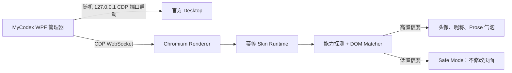

# MyCodex

MyCodex `0.1.1-alpha` 是一个本地 Windows 管理器，为官方 Codex /
ChatGPT Desktop 对话界面增加可自定义的 Assistant/User 头像和昵称，并仅为
Assistant 正文增加紧凑气泡；User 继续使用官方原生气泡。

它由独立 GUI 管理器、CDP Runtime Injector 和 DOM Skin Engine 组成；它不是
Overlay、OCR 重绘、DLL 注入、浏览器扩展、API 客户端，也不会修改 `app.asar`。

[English](README.md)

## 概览

MyCodex 只调整对话消息区域。Assistant 左对齐，User 右对齐；Assistant 的普通
prose/Markdown 文本进入气泡，代码块、Diff、Tool Card、处理状态、操作按钮和
输入框继续使用官方原生 UI。User 气泡的背景、圆角、内边距、宽度和位置完全保留。

## 截图


这是项目自行绘制的合成预览，不包含 OpenAI 素材、应用 Bundle 或真实聊天数据。

## 功能

- Assistant/User 头像与昵称
- 头像默认使用居中裁剪的圆形显示
- English、简体中文、繁體中文界面即时切换并持久化
- 完全参数化的 Reference Dark Assistant 正文气泡
- User 原生气泡不改色、不改尺寸、不改 padding、不改位置
- 基于结构签名和置信度的 User/Assistant Turn 识别
- 过滤随机/压缩 class，适应轻中度 DOM 更新
- 手动校准、Hover 高亮、Escape 取消和重新校准
- 兼容性检测、降级状态与 Fail-closed Safe Mode
- 配置即时应用、Runtime/样式健康检查、SPA 根节点自愈和 Target 重建后自动重注入
- Disable/退出时可靠 `destroy()`，恢复官方 DOM/CSS
- 本地脱敏诊断、零遥测

## 工作原理



管理器发现官方安装，使用随机回环端口启动应用，结合 URL、类型、标题和 DOM
能力选择 Renderer，注入内置 Runtime 并完成版本化协议握手。Runtime 不拥有宿主
权限；随机命名的 Binding 只能向管理器发送白名单事件，不能执行 Shell、读文件或
发起任意网络请求。

## 安装

要求：

- Windows 10/11 x64
- 已安装官方 Codex / ChatGPT Desktop

从 GitHub Releases 下载 `MyCodex-win-x64.zip`，解压到可写目录，运行
`MyCodex.exe`。发行包为 self-contained，无需另装 .NET Runtime、Node、npm
或 Visual Studio。

Alpha 版本暂未签名，Windows 可能显示信誉提示；请先核对发布源码与校验值。

## 首次设置

1. 启动 MyCodex，完成仅本地的首次说明。
2. 确认检测到的官方 Desktop。
3. 点击 **Start Codex with MyCodex**。
4. 若官方应用已经运行，同意先正常重启。只有正常关闭超时后才会二次确认是否强制
   结束所选进程。
5. 打开一个对话；若自动识别置信度不足，完成 Assistant 与 User 两步校准。

MyCodex 仅绑定 `127.0.0.1`，每次托管启动都选择新的临时端口。

## 自定义

可在侧边栏的“界面语言”中选择 **English**、**简体中文** 或 **繁體中文**。
切换立即生效并独立保存，不会覆盖尚未保存的外观编辑；首次启动引导中也提供同一选项。

Appearance 页面支持昵称、头像、头像尺寸、Assistant 气泡圆角、横纵 padding、
消息间距、最大宽度和昵称显示开关。头像支持 PNG/JPEG/GIF/BMP，最大 10 MiB；文件会校验真实
签名，以内容哈希命名并复制到本地头像目录，再以 data URL 传给 Runtime。

**Save & apply** 会原子保存配置并即时更新已连接 Renderer。**Disable skin**
会调用 Runtime 清理并恢复官方界面，不关闭 Desktop。

## 校准

校准只保存结构签名，不保存聊天正文。

1. 点击 **Calibrate assistant**，在官方窗口中移动鼠标，目标 Turn 高亮后点击。
2. 点击 **Calibrate user**，选择一条普通 User 消息。
3. 按 Escape 可取消；重新执行某一步即可覆盖误选结果。

选择器使用 `event.composedPath()` 向父层寻找语义 Turn Root。签名包含稳定属性、
祖先结构、子标签形状、布局比例和能力，并以版本化 `calibration.json` 保存。

## 兼容性

兼容性依据实际能力和置信度，而非硬编码应用版本。Application Adapter、Injection
Backend、DOM Matcher 与 Skin Engine 彼此独立。

- **Compatible**：两类消息高置信度匹配，启用皮肤。
- **Degraded**：仍可匹配，但建议重新校准。
- **Safe Mode**：页面结构未知，不进行皮肤 DOM Mutation。
- **Injection unavailable**：CDP 不可用；绝不会转而修改官方文件。

详见 [兼容性架构](docs/compatibility.md)。

## 更新兼容

官方 Desktop 更新后按三级机制恢复：

1. **自动兼容检测**：每次托管启动前刷新当前 Store 包入口，再探测 Renderer；
   优先识别当前稳定语义/结构 Turn，旧校准签名只作为后备。连接期间会持续检查
   Runtime、样式与 Observer 健康状态。
2. **重新校准**：修复 wrapper、属性、布局或随机 class 变化，不清空外观设置和旧配置。
3. **发布新版 MyCodex**：若注入边界改变或 Renderer 大规模重构，需要更新 Backend
   或 DOM Adapter。

项目不会宣称永久兼容未来所有 Codex / ChatGPT Desktop 版本。

## 诊断

Diagnostics 页面只输出 Manager/Runtime 协议版本、候选应用元数据、CDP Target
数量、兼容状态、匹配数量、平均置信度、Observer 状态和错误代码。它不会输出消息
正文、Prompt、代码、Token、Cookie、Authorization、账户资料或不必要路径。

日志位于 `%APPDATA%\MyCodex\logs`。提交 Issue 前请自行检查要附加的诊断内容。

## 隐私

MyCodex 完全本地运行，不要求 OpenAI 凭据，不上传对话，不读取认证 Cookie，不
拦截网络请求，也没有 Analytics、Sentry 或任何遥测。配置保存在
`%APPDATA%\MyCodex`。

请阅读 [PRIVACY.md](PRIVACY.md) 与 [SECURITY.md](SECURITY.md)。

## 已知限制

- 当前为未签名的 Windows x64 Alpha 版本。
- 官方应用若未以 CDP 参数启动，需要正常重启一次。
- DOM 更新可能要求重新校准；大改版可能要求新的 MyCodex 版本。
- 校准属于本地配置，当前针对可见 Renderer。
- 系统托盘、开机启动和高级颜色选择器属于 MVP 后续功能。
- 不同官方版本的已登录真实对话结构会有差异，Safe Mode 因此刻意保守。

## 开发

需要 .NET 8 SDK、Node.js 20+、npm 和支持 WPF 的 Windows。

```text
src/MyCodex.Manager     WPF 管理器
src/MyCodex.Core        应用发现、CDP、注入、配置、兼容性
src/MyCodex.Runtime     TypeScript DOM Runtime 与 jsdom 测试
tools/MyCodex.CdpProbe  独立可行性门禁
tests/MyCodex.Tests     xUnit 测试
docs                    架构与兼容性说明
```

仓库不得包含 OpenAI 二进制、Bundle、真实 DOM Snapshot、图标、源码或用户聊天数据。

## 构建

```powershell
cd src\MyCodex.Runtime
npm ci
npm run check
cd ..\..
dotnet restore MyCodex.sln
dotnet build MyCodex.sln -c Release --no-restore
dotnet test MyCodex.sln -c Release --no-build
dotnet publish src\MyCodex.Manager\MyCodex.Manager.csproj `
  -c Release -r win-x64 --self-contained true
```

生成与 CI 一致的发行包：

```powershell
.\scripts\build-release.ps1
```

如代理较慢或使用中国大陆网络，可仅对本次构建启用国内镜像：

```powershell
.\scripts\build-release.ps1 -UseChinaMirrors
```

该开关使用 npmmirror 与华为云 NuGet 镜像，不修改全局包管理器设置。

## 参与贡献

请阅读 [CONTRIBUTING.md](CONTRIBUTING.md)。兼容性 Fixture 必须自行合成，禁止
提交官方真实 DOM Snapshot 或聊天数据。

## 许可证

[MIT](LICENSE)，Copyright © 2026 MyCodex Contributors。

## 免责声明

MyCodex 是独立开源项目，与 OpenAI 无隶属、认可或赞助关系。项目要求用户自行安装
官方 Codex / ChatGPT Desktop，且不分发该应用的任何组成部分。
