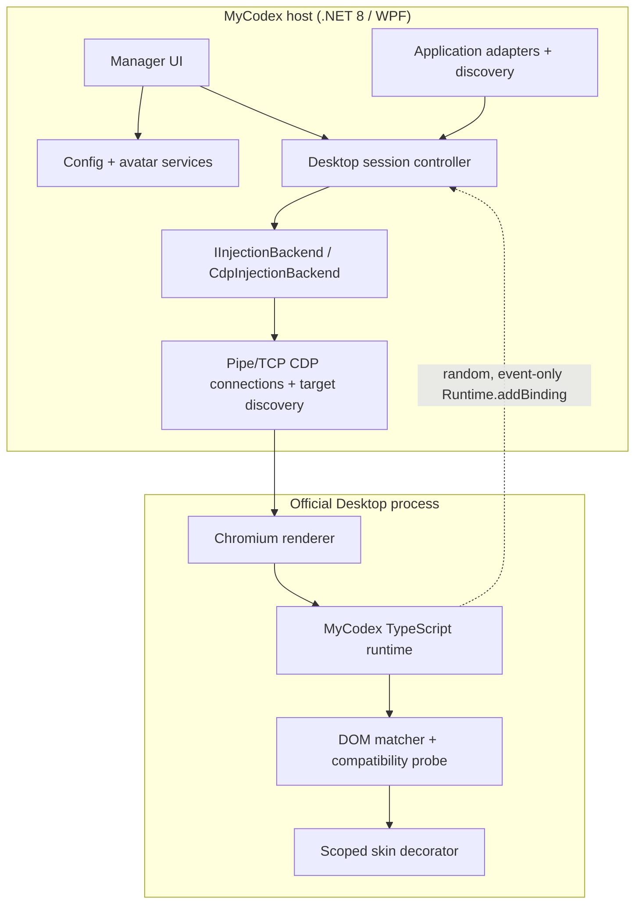

# Architecture

## Design goals

MyCodex changes the real conversation DOM while preserving the official
application's window, navigation, composer, code/diff/tool surfaces, and native
controls. It is local, reversible, update-aware, and fail closed.

## Components

### Manager

`MyCodex.Manager` is a single-instance WPF application. It owns user consent for
restarts, preview/editing, calibration commands, diagnostics, and orderly
shutdown. Exiting calls runtime `destroy()` and disconnects CDP; it does not
close an official Desktop process it launched.

### Core

`MyCodex.Core` contains:

- installed/running application discovery and candidate scoring;
- `ChatGptDesktopAdapter` and `LegacyCodexAdapter`;
- private-pipe launch with a restricted inherited handle list;
- explicit-consent loopback port allocation and CDP HTTP/WebSocket fallback;
- renderer capability scoring;
- `IInjectionBackend` and the initial `CdpInjectionBackend`;
- runtime session lifecycle and target monitoring;
- configuration migration/recovery and avatar import;
- compatibility signatures/state machine and privacy-safe logging.

The skin engine has no compile-time dependency on a particular Desktop version.

### Runtime

The embedded IIFE exposes a non-enumerable API through
`Symbol.for("mycodex.runtime.protocol.1")` and a compatibility window property.
`install()` is idempotent. `ensureActive()` verifies and repairs the style,
observer, and current SPA conversation root. `applyConfig()` updates CSS
variables and structural calibration. `destroy()` removes observers, listeners,
attributes, injected identity elements/styles, and new-document registration.

The runtime:

- finds a conversation root by semantic/capability selectors;
- scans bounded turn candidates;
- classifies role using stable semantics and current renderer structure first,
  then calibration and layout fallbacks;
- decorates only at confidence `>= 0.72`;
- inserts project-namespaced headers;
- marks only assistant prose blocks as bubbles and leaves the official user
  bubble untouched;
- excludes `pre`, `code`, diffs, tool/status/command cards, toolbars, buttons,
  editors, and input controls;
- rescans incrementally through a debounced `MutationObserver`.

## CDP lifecycle

1. Create two anonymous pipes and inherit only Chromium's read/write handles.
2. Launch the selected official executable with `--remote-debugging-pipe` and
   `--remote-debugging-io-pipes`; no TCP listener is created.
3. Request browser targets over the null-delimited private pipe.
4. If Pipe startup fails, clean up that owned process and ask the user whether
   to retry with a random `127.0.0.1` TCP port.
5. Score targets using type, URL/title hints, and a read-only DOM capability
   probe.
6. Attach a transport-neutral target client and enable Runtime/Page domains.
7. Register a random `__mc_host_<guid>` binding.
8. Register the bootstrap with `Page.addScriptToEvaluateOnNewDocument` and
   evaluate it immediately.
9. Verify manager/runtime protocol versions.
10. Poll target identity and Runtime health; repair the current page, inject new
   renderers, and clean up missing or unhealthy sessions.

CDP command IDs are generated atomically and responses are correlated through
independent task completions, so events and out-of-order responses are safe.

## Runtime-to-host boundary

The page can only emit the following event types:

- `calibrationResult`
- `runtimeReady`
- `diagnostics`
- `compatibilityChanged`
- `error`

The binding accepts event data only. It exposes no host request/response API,
shell, filesystem, process, credential, or networking capability.

## Configuration

`%APPDATA%\MyCodex` contains `config.json`, `calibration.json`, `avatars/`,
`logs/`, and `backups/`. Writes use a unique temporary file followed by an
atomic move. Schema 0 appearance names/avatars migrate to schema 1. Legacy
avatars are validated and copied into the managed directory. Invalid JSON is
moved to a bounded timestamped backup set and defaults are restored without
crashing.

The schema 1 `language` field accepts `en-US`, `zh-CN`, or `zh-TW`. Missing
values remain backward-compatible with English. WPF dynamic resources switch
immediately, while language persistence is serialized through the same atomic
configuration store and does not implicitly save in-progress appearance edits.

## Failure behavior

No CDP endpoint produces **InjectionBackendUnsupported**. Handshake mismatch
produces **RuntimeProtocolMismatch**. A runtime error, zero matches, or low
confidence produces **SafeMode**. Safe mode leaves the official DOM unchanged
and keeps diagnostics/calibration available.

MyCodex never changes an official install, injects native code, intercepts
traffic, or falls back to patching.
