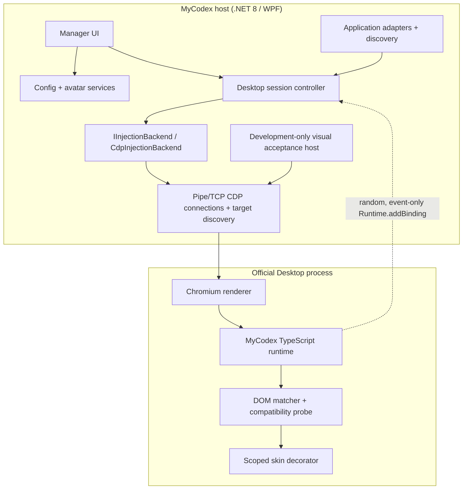

# Architecture

## Design goals

MyCodex changes the real conversation DOM while preserving the official
application's window, navigation, composer, code/diff/tool surfaces, and native
controls. It is local, reversible, update-aware, and fail closed.

## Components

### Manager

`MyCodex.Manager` is a single-instance WPF application. It owns preview/editing,
calibration commands, diagnostics, its independent WPF theme, verified restart,
and orderly shutdown. `WindowChrome` delegates minimize, maximize, restore,
caption drag, and resize to the Windows window state machine. Taskbar minimize
remains an ordinary visible taskbar state; only the explicit close choice
`Minimize to tray` calls the background-hide route. An App-owned `NotifyIcon`
and the named activation event restore the same window and its last
non-minimized state. Close presents one short prompt with Exit / Minimize /
Cancel. Exiting calls runtime `destroy()`, disconnects CDP, unsubscribes
system-theme events, and disposes the icon; duplicated pipe peer handles owned
by the exact Codex root prevent that disconnect from closing Codex.

### Core

`MyCodex.Core` contains:

- installed/running application discovery and candidate scoring;
- `ChatGptDesktopAdapter` and `LegacyCodexAdapter`;
- private-pipe launch with a restricted inherited handle list;
- suspended private-pipe creation plus non-inheritable peer-handle duplication
  into the exact Codex root so Manager lifetime is independent;
- explicit-consent loopback port allocation and CDP HTTP/WebSocket fallback;
- renderer capability scoring;
- `IInjectionBackend` and the initial `CdpInjectionBackend`;
- runtime session lifecycle and target monitoring;
- configuration migration/recovery and avatar import;
- per-user `HKCU\...\Run` registration through
  `IStartupRegistrationService`, including exact-value removal and path-drift
  correction;
- one restart transaction for graceful close, exact-identity force fallback,
  stable process-tree quiescence, bounded launch/readiness retry, and state
  recovery after failure;
- exact-identity production restart tracking across visible and tray-only
  states, with multi-root and PID-reuse fail-closed guards;
- compatibility signatures/state machine and privacy-safe logging.

The skin engine has no compile-time dependency on a particular Desktop version.

### Development-only visual acceptance

`MyCodex.VisualAcceptance` reuses `WindowsPipeProcessLauncher`,
`PipeCdpConnection`, `RuntimeInjector`, and the production Runtime bundle. It
creates one isolated profile under `%TEMP%\MyCodex\VisualAcceptance\<run-id>`,
installs a synthetic fixture in the official `app://` renderer, and exposes
Start, Restart Target, Status, Disable/destroy, and Stop commands.

The host stores the exact launched PID and verifies run-id, executable, process
start time, and profile metadata before every close. It never calls the normal
application-wide restart service and never enumerates/terminates all processes
by executable name. A restart reuses the same isolated profile; Stop destroys
the Runtime, closes only the owned target tree, validates the canonical cleanup
path, and removes the run directory.

### Runtime

The embedded IIFE exposes a non-enumerable API through
`Symbol.for("mycodex.runtime.protocol.1")` and a compatibility window property.
`install()` is idempotent. `ensureActive()` verifies and repairs the style,
observer, and current SPA conversation root. `applyConfig()` updates CSS
variables and structural calibration. `destroy()` removes observers, listeners,
attributes, injected identity elements/styles, and new-document registration.

The runtime:

- resolves the current host theme through `HostThemeDetector`;
- accepts a conversation root only when it has explicit turn, unit, role, or
  user-bubble evidence; an empty workspace, header, sidebar, or composer is not
  a conversation;
- scans bounded, non-nested turn candidates inside that confirmed root;
- classifies role using stable semantics and current renderer structure first,
  then a validated multi-sample calibration signature; saved screen position
  and layout are never classification fallbacks;
- decorates only at confidence `>= 0.72`;
- assigns one identity owner per role and logical conversation turn, so
  renderer layouts with multiple content units cannot duplicate avatars or
  nicknames;
- reconciles exactly one project-namespaced avatar/nickname pair as direct
  children of each legal identity owner and removes duplicates or orphans;
- semantically groups only assistant prose as Automatic or Whole bubbles and
  leaves the official user bubble untouched; Whole mode prefers an existing
  stable Markdown surface and does not move or rewrite native nodes;
- keeps headings with following prose, lists/quotes atomic, and existing
  streaming block groups stable until structure changes;
- excludes `pre`, `code`, diffs, tool/status/command cards, toolbars, buttons,
  editors, and input controls;
- observes only the current confirmed conversation root, batches mutations,
  refreshes affected turns during streaming, and keeps one active observer.

Theme changes update only five project-scoped palette variables. They do not
rescan or redecorate the conversation. `HostThemeDetector` owns bounded
root/body attribute observers, a root child-list observer for renderer
reconstruction, and one media-query listener; `destroy()` removes all of them.

## Theme route decisions

### Codex renderer theme

Four routes were compared:

| Route | Benefit | Reason not selected alone |
| --- | --- | --- |
| `prefers-color-scheme` only | Small and stable API | Describes Windows/Chromium preference and can disagree with Codex's in-app choice |
| Codex DOM token only | Fast response | A private class or attribute can change across official releases |
| Computed background only | Avoids generated class names | Transparent/local panels and transitions can be ambiguous |
| Hybrid detector | Cross-checks independent signals and can fail closed | Selected; slightly more code, kept in a separately tested component |

The hybrid order is a recognized root/body theme attribute or semantic class,
then luminance from bounded root/body/main surfaces, then
`prefers-color-scheme` as low-confidence fallback. A result contains
`light`, `dark`, or `unknown`, confidence, and short text-free evidence.
Conflicting explicit/surface evidence lowers confidence. `unknown` preserves
the last trusted palette and performs no risky override. Changes are debounced
at 50 ms, below the 250 ms interaction target.

### Manager theme

Per-page color copies were rejected because they drift and cannot atomically
cover control states. A third-party theme framework was rejected because the
required surface is small and a large UI dependency would add maintenance and
supply-chain cost. Two semantic WPF `ResourceDictionary` palettes plus
`DynamicResource` and `ThemeService` were selected. `ThemeService` resolves
Dark/Light/System, swaps one dictionary on the UI Dispatcher, and owns the
static Windows preference subscription.

The Manager effective theme and renderer bubble theme are deliberately
independent configuration and service states.

## Startup and tray route decisions

For a self-contained ZIP application, per-user `HKCU Run` was selected:

| Route | Decision |
| --- | --- |
| `HKCU\...\Run` | Selected: standard-user, reversible, simple background command |
| Startup-folder shortcut | Rejected: extra Shell-link lifecycle and path-drift handling |
| Task Scheduler | Rejected: unnecessary persistence/complexity and possible policy friction |
| MSIX `StartupTask` | Deferred until MyCodex is actually packaged as MSIX |

The fixed value is `MyCodex`; its data is the fully quoted current executable
plus `--background`. Save is transactional with the versioned config, and
startup reconciliation corrects a moved executable or precisely removes only
that value. Background launch never asks for TCP consent or shows a blocking
dialog. It starts Codex over the existing private-pipe route only when no
Desktop is already running; an uncontrolled running Desktop is reported rather
than duplicated.

The existing `TrayService` is the single notification-icon owner. The caption
minimize command calls the native taskbar minimize path and never hides the
window. Only the explicit close-dialog Minimize action hides the window and its
taskbar button. Double-click, the tray menu, or the single-instance activation
event restores/focuses it without creating another window. Close presents Exit,
Minimize, and Cancel. Tray Exit invokes the same orderly self-only close path;
tray Restart uses the verified restart transaction.

## CDP lifecycle

1. Create two anonymous pipes and inherit only Chromium's read/write handles.
2. Create the selected official executable suspended with
   `--remote-debugging-pipe` and
   `--remote-debugging-io-pipes`; no TCP listener is created.
3. Duplicate both host-side peer handles into that exact root as
   non-inheritable handles, then resume it.
4. Request browser targets over the null-delimited private pipe and wait for an
   observer-active Runtime session before reporting success.
5. Score targets using type, URL/title hints, and a read-only DOM capability
   probe.
6. Attach a transport-neutral target client and enable Runtime/Page domains.
7. Register a random `__mc_host_<guid>` binding.
8. Register the bootstrap with `Page.addScriptToEvaluateOnNewDocument` and
   evaluate it immediately.
9. Verify manager/runtime protocol versions.
10. Poll target identity and Runtime health; repair the current page, inject new
    renderers, and clean up missing or unhealthy sessions.

Calibration is started in every renderer with positive conversation evidence.
Each role requires three different legal message roots. Clicking nested prose
climbs to that root, while protected code, Diff, tool, status, toolbar,
navigation, dialog, editor, and input surfaces are rejected. The three samples
produce a text-free consensus signature plus conversation-context fingerprint;
layout coordinates, text, generated classes, and list positions are not
persisted. The generated rule must identify legal same-role messages in the
current conversation, including at least one held-out message that was not
selected as a sample, before it is emitted. The first validated result for the
requested role wins and cancels the other renderer calibrations.

Repeated discovery and Runtime-evidence observations are logged only when their
privacy-safe snapshots change. Polling therefore remains observable without
flooding the bounded diagnostics log.

CDP command IDs are generated atomically and responses are correlated through
independent task completions, so events and out-of-order responses are safe.

## Runtime-to-host boundary

The page can only emit the following event types:

- `calibrationResult`
- `runtimeReady`
- `diagnostics`
- `compatibilityChanged`
- `error`

The binding accepts event data only. It exposes no host request/response API,
shell, filesystem, process, credential, or networking capability.

## Configuration

`%APPDATA%\MyCodex` contains `config.json`, `calibration.json`, `avatars/`,
`logs/`, and `backups/`. Writes use a unique temporary file followed by an
atomic move. Config schema 3 adds `bubbleDisplayMode`; schema 2 separates
Manager theme/startup options and Dark/Light bubble palettes. Schema 0/1 names,
avatar paths, layout, language,
custom Assistant colors migrate without reset; legacy colors become the Dark
palette and the Light palette receives contrast-safe defaults. Legacy
single-sample calibration is explicitly invalidated because it has no verified
conversation context, while all unrelated preferences and avatar paths remain.
Legacy avatars are validated and copied into the managed directory. Invalid JSON is
moved to a bounded timestamped backup set and defaults are restored without
crashing.

The `language` field accepts `en-US`, `zh-CN`, or `zh-TW`. Missing
values remain backward-compatible with English. WPF dynamic resources switch
immediately, while language persistence is serialized through the same atomic
configuration store and does not implicitly save in-progress appearance edits.

## Failure behavior

No CDP endpoint produces **InjectionBackendUnsupported**. Handshake mismatch
produces **RuntimeProtocolMismatch**. A runtime error, zero matches, or low
confidence produces **SafeMode**. Safe mode leaves the official DOM unchanged
and keeps diagnostics/calibration available.

Restart failure is reported by stage: unsafe identity, verified-force failure,
shutdown/quiescence failure, launch failure, or renderer-readiness failure.
The Manager refreshes actual process state after a failed transaction, so the
next Start/Restart action never depends on a stale half-closed candidate.

MyCodex never changes an official install, injects native code, intercepts
traffic, or falls back to patching.

The complete development acceptance command chain is documented in
[`visual-acceptance.md`](visual-acceptance.md).
