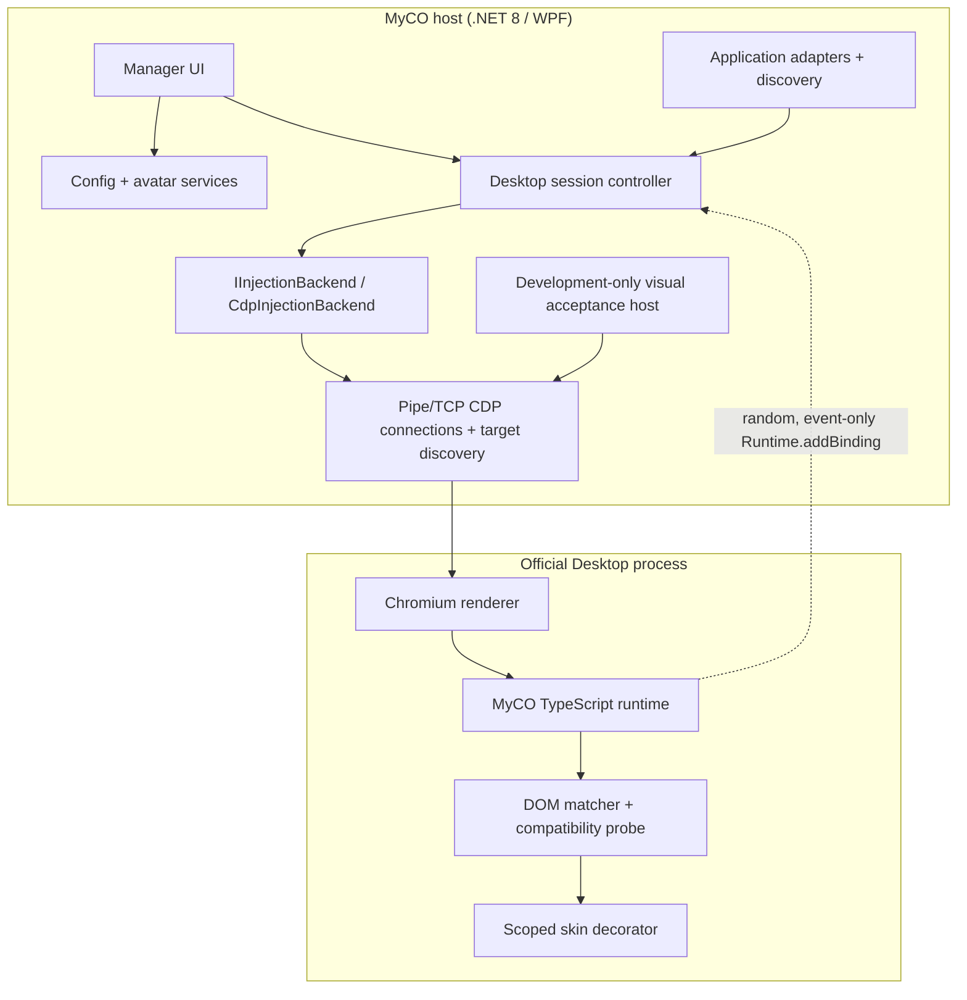

# Architecture

## Design goals

MyCO changes the real conversation DOM while preserving the official
application's window, navigation, composer, code/diff/tool surfaces, and native
controls. It is local, reversible, update-aware, and fail closed.

## Components

### Manager

`MyCO.Manager` is a single-instance WPF application. It owns preview/editing,
calibration commands, diagnostics, its independent WPF theme, verified restart,
and orderly shutdown. `WindowChrome` delegates maximize, restore, caption drag,
and resize to the Windows window state machine. Every user-triggered minimize
path enters the tray state machine, sets `ShowInTaskbar=false`, hides the
window, and preserves its last Normal/Maximized state. An App-owned `NotifyIcon`
and the named activation event restore the same window. A boot-session marker
in MyCO config gates one localized user-minimize balloon per Windows boot;
background startup and duplicate state events are silent. Close presents one
short prompt with Exit / Minimize / Cancel. Exiting calls runtime `destroy()`,
disconnects CDP, unsubscribes system-theme events, and disposes the icon;
duplicated pipe peer handles owned by the exact Codex root prevent that
disconnect from closing Codex.

The kernel mutex and activation-event names deliberately retain their
pre-rename values so an old build and a MyCO build cannot run side by side.
These names are internal compatibility identifiers and are never displayed.

Home and Appearance host the same `ChatPreviewControl` against the same
`MainWindowViewModel`. A session-local Codex preview-theme selection resolves
the preview background, borders, both role bubbles, text, nicknames, avatars,
and elevation together. It is deliberately independent from the Manager theme
and does not persist or alter the Runtime palette. On startup it is initialized
from the Manager's effective theme, so the default `System` mode matches the
current Windows theme. While following the Manager, a Windows theme change
updates the preview; an explicit preview selection is respected for the rest
of that session.

Both preview roles use `PreviewBubbleStyle` and one computed
`PreviewBubbleMaxWidth`. The role brushes remain separate, but radius, padding,
content measurement, and maximum width are not duplicated between Assistant
and User previews.

`SaveAndApplyAsync` first atomically persists schema 7, then asks
`DesktopSessionController` to apply one serialized config transaction to every
current renderer. Renderer calls fan out concurrently, but consecutive save
transactions are serialized so the latest call wins. Each renderer must return
valid Runtime diagnostics before it counts as applied; zero sessions and
partial failures are surfaced distinctly. A replacement new-document script is
registered before the prior registration is removed, so navigation coverage is
not lost when registration or cleanup fails.

### Core

`MyCO.Core` contains:

- installed/running application discovery and candidate scoring;
- `ChatGptDesktopAdapter` and `LegacyCodexAdapter`;
- private-pipe launch with a restricted inherited handle list;
- suspended private-pipe creation plus non-inheritable peer-handle duplication
  into the exact Codex root so Manager lifetime is independent;
- explicit-consent loopback port allocation and CDP HTTP/WebSocket fallback;
- renderer capability scoring;
- `IInjectionBackend` and the initial `CdpInjectionBackend`;
- runtime session lifecycle and target monitoring;
- configuration migration/recovery and avatar import;
- optional MyCO-owned Codex launch associations and AUMID identity;
- official GitHub release checking, bounded package validation, and the
  project-owned external updater;
- first-run packaged-logo seeding and the Manager avatar crop workflow;
- per-user `HKCU\...\Run` registration through
  `IStartupRegistrationService`, including exact-value removal and path-drift
  correction;
- one restart transaction for graceful close, exact-identity force fallback,
  stable process-tree quiescence, bounded launch/readiness retry, and state
  recovery after failure;
- exact-identity production restart tracking across visible and tray-only
  states, with multi-root and PID-reuse fail-closed guards;
- compatibility signatures/state machine and privacy-safe logging.

The skin engine has no compile-time dependency on a particular Desktop version.

### Development-only visual acceptance

`MyCO.VisualAcceptance` reuses `WindowsPipeProcessLauncher`,
`PipeCdpConnection`, `RuntimeInjector`, and the production Runtime bundle. It
creates one isolated profile under `%TEMP%\MyCO\VisualAcceptance\<run-id>`,
installs a synthetic fixture in the official `app://` renderer, and exposes
Start, Restart Target, Status, Disable/destroy, and Stop commands.

The host stores the exact launched PID and verifies run-id, executable, process
start time, and profile metadata before every close. It never calls the normal
application-wide restart service and never enumerates/terminates all processes
by executable name. A restart reuses the same isolated profile; Stop destroys
the Runtime, closes only the owned target tree, validates the canonical cleanup
path, and removes the run directory.

### Runtime

The embedded IIFE exposes a non-enumerable API through
`Symbol.for("myco.runtime.protocol.1")` and a compatibility window property.
Before installation it detects and destroys the pre-rename Runtime symbol/API,
then removes that legacy registry entry so old and new DOM ownership cannot
overlap.
`install()` is idempotent. `ensureActive()` verifies and repairs the style,
observer, and current SPA conversation root. `applyConfig()` updates CSS
variables and structural calibration. `destroy()` removes observers, listeners,
attributes, injected identity elements/styles, and new-document registration.

The runtime:

- resolves the current host theme through `HostThemeDetector`;
- accepts a conversation root only when it has explicit turn, unit, role, or
  user-bubble evidence; an empty workspace, header, sidebar, or composer is not
  a conversation;
- scans bounded, non-nested turn candidates inside that confirmed root;
- classifies role using stable semantics and current renderer structure first,
  then a validated multi-sample calibration signature; saved screen position
  and layout are never classification fallbacks;
- decorates only at confidence `>= 0.72`;
- assigns one identity owner to each distinct legal message unit; multiple
  Assistant progress/final units inside one logical turn each receive one
  avatar and nickname, while Markdown children inside a unit never become
  separate identity owners;
- reconciles exactly one project-namespaced avatar/nickname pair as direct
  children of each legal identity owner and removes duplicates or orphans;
- semantically groups only assistant prose as Automatic or Whole bubbles and
  leaves the official user bubble untouched; Whole mode prefers the innermost
  existing stable Markdown surface, rejects shells containing protected
  content, and does not move or rewrite native nodes;
- rejects flex/grid/stretch Markdown layout shells and falls back to safe
  semantic prose blocks when no stable content surface exists;
- bounds bubble width with `max-content`, auto height, a zero flex minimum, and
  the available-space maximum so short content shrinks while long content wraps
  instead of becoming a narrow page-height surface;
- keeps headings with following prose, lists/quotes atomic, and existing
  streaming block groups stable until structure changes;
- excludes `pre`, `code`, diffs, tool/status/command cards, toolbars, buttons,
  editors, and input controls;
- observes only the current confirmed conversation root, batches mutations,
  refreshes affected turns during streaming, and keeps one active observer.

Theme changes update only five project-scoped palette variables. They do not
rescan or redecorate the conversation. `HostThemeDetector` owns bounded
root/body attribute observers, a root child-list observer for renderer
reconstruction, and one media-query listener; `destroy()` removes all of them.

## Theme route decisions

### Codex renderer theme

Four routes were compared:

| Route | Benefit | Reason not selected alone |
| --- | --- | --- |
| `prefers-color-scheme` only | Small and stable API | Describes Windows/Chromium preference and can disagree with Codex's in-app choice |
| Codex DOM token only | Fast response | A private class or attribute can change across official releases |
| Computed background only | Avoids generated class names | Transparent/local panels and transitions can be ambiguous |
| Hybrid detector | Cross-checks independent signals and can fail closed | Selected; slightly more code, kept in a separately tested component |

The hybrid order is a recognized root/body theme attribute or semantic class,
then luminance from bounded root/body/main surfaces, then
`prefers-color-scheme` as low-confidence fallback. A result contains
`light`, `dark`, or `unknown`, confidence, and short text-free evidence.
Conflicting explicit/surface evidence lowers confidence. `unknown` preserves
the last trusted palette and performs no risky override. Changes are debounced
at 50 ms, below the 250 ms interaction target.

### Manager theme

Per-page color copies were rejected because they drift and cannot atomically
cover control states. A third-party theme framework was rejected because the
required surface is small and a large UI dependency would add maintenance and
supply-chain cost. Two semantic WPF `ResourceDictionary` palettes plus
`DynamicResource` and `ThemeService` were selected. `ThemeService` resolves
Dark/Light/System, swaps one dictionary on the UI Dispatcher, and owns the
static Windows preference subscription.

The Manager effective theme and renderer bubble theme are deliberately
independent configuration and service states.

## Startup and tray route decisions

For a self-contained ZIP application, per-user `HKCU Run` was selected:

| Route | Decision |
| --- | --- |
| `HKCU\...\Run` | Selected: standard-user, reversible, simple background command |
| Startup-folder shortcut | Rejected: extra Shell-link lifecycle and path-drift handling |
| Task Scheduler | Rejected: unnecessary persistence/complexity and possible policy friction |
| MSIX `StartupTask` | Deferred until MyCO is actually packaged as MSIX |

The current visible value is `MyCO`; its data is the fully quoted current
executable plus `--background`. Startup reconciliation accepts the prior
`Myco` and legacy `MyCodex` values, then verifies the current value before
removing only those known predecessors. Save is transactional with the
versioned config, and reconciliation corrects a moved executable. Background
launch never asks for TCP consent or shows a blocking dialog. It starts Codex
over the existing private-pipe route only when no Desktop is already running;
an uncontrolled running Desktop is reported rather than duplicated.

The existing `TrayService` is the single notification-icon owner. Caption,
system, and close-dialog user-minimize paths all hide the window and taskbar
button through the same state machine. Double-click, the tray menu, or the
single-instance activation event restores/focuses it without creating another
window. The one-per-Windows-boot balloon is backed by a persisted uptime-derived
identity. Close presents Exit, Minimize, and Cancel. Tray Exit invokes the same
orderly self-only close path; tray Restart uses the verified restart transaction.
The balloon title is the invariant product phrase `It's MyCO!!!!!`; its body is
localized. MyCO also maintains its own per-user Start-menu identity shortcut
with the packaged icon and `Crikok.MyCO` AUMID. The existing BalloonTip remains
the dependency-free Windows 10/11 compatibility route; no self-drawn popup or
Windows App SDK runtime is introduced.

### Codex launch association feasibility matrix

The setting is default-off and changes only MyCO-owned launch surfaces:

| Entry | Owner | Implementation | Coverage | Reversal | Windows 10/11 limit |
| --- | --- | --- | --- | --- | --- |
| Start menu | MyCO | Per-user `MyCO - Codex.lnk` with `--codex-launch` | MyCO-created shortcut only | Delete exact MyCO-owned shortcut | Does not rewrite an official Codex shortcut |
| Desktop | MyCO | Per-user `MyCO - Codex.lnk` with `--codex-launch` | MyCO-created shortcut only | Delete exact MyCO-owned shortcut | Existing user shortcut is never overwritten |
| Taskbar pinned item | Windows Shell / user | No automatic rewrite; offer MyCO shortcut and re-pin guidance | Not covered | User unpins/re-pins explicitly | Standard-user APIs require user confirmation and do not safely retarget an existing official pin |
| Protocol | MyCO per-user registration | `myco-codex:` under `HKCU\Software\Classes` | MyCO protocol launches | Delete exact MyCO command registration | Does not claim or replace `codex://` or unknown protocols |
| AUMID | MyCO process | `SetCurrentProcessExplicitAppUserModelID` for `Crikok.MyCO` | MyCO taskbar/notification identity | Process identity ends with MyCO | Cannot inherit or impersonate Codex's AUMID |

No entry modifies Codex binaries, installation directories, configuration,
profiles, credentials, or pinned taskbar state. Existing foreign shortcuts and
protocols are left unchanged; therefore there is no foreign shortcut backup to
restore. MyCO-created entries are removed only after exact ownership checks.
Associated launches signal the existing single instance when one is already
running; they never start a second MyCO or duplicate a running Codex session.
Shortcut operations validate every existing component below the trusted
special-folder root and reject reparse points. File and protocol transactions
seal the observed generation, recheck ownership immediately before mutation,
and compare before rollback; a concurrent foreign replacement is never deleted
or overwritten. Settings save and factory reset retain an opaque three-entry
snapshot so partial or path-drifted MyCO state can be restored precisely.

### Update route

Settings checks the official GitHub release list with an explicit User-Agent,
timeout, cancellation, and semantic-version comparison. Drafts and previews
are ignored. Only the exact x64 ZIP and SHA-256 asset names are accepted. The
Manager downloads to a unique `%TEMP%\MyCO\Updates` directory, validates the
repository URL, size, hash, archive paths, reparse points, and extracted file
list, then copies the project-owned updater outside the install directory. The
updater verifies the exact Manager PID, path, and UTC start-time ticks before
waiting for exit, performs the staged directory replacement with rollback, and
starts only the verified new `MyCO.exe`. It never touches `%APPDATA%` or Codex
data and never requests elevation.

## CDP lifecycle

1. Create two anonymous pipes and inherit only Chromium's read/write handles.
2. Create the selected official executable suspended with
   `--remote-debugging-pipe` and
   `--remote-debugging-io-pipes`; no TCP listener is created.
3. Duplicate both host-side peer handles into that exact root as
   non-inheritable handles, then resume it.
4. Request browser targets over the null-delimited private pipe and wait for an
   observer-active Runtime session before reporting success.
5. Score targets using type, URL/title hints, and a read-only DOM capability
   probe.
6. Attach a transport-neutral target client and enable Runtime/Page domains.
7. Register a random `__mc_host_<guid>` binding.
8. Register the bootstrap with `Page.addScriptToEvaluateOnNewDocument` and
   evaluate it immediately.
9. Verify manager/runtime protocol versions.
10. Poll target identity and Runtime health; repair the current page, inject new
    renderers, and clean up missing or unhealthy sessions.

Calibration is started in every renderer with positive conversation evidence.
Each role requires three different legal message roots. Clicking nested prose
climbs to that root, while protected code, Diff, tool, status, toolbar,
navigation, dialog, editor, and input surfaces are rejected. The three samples
produce a text-free consensus signature plus conversation-context fingerprint;
layout coordinates, text, generated classes, and list positions are not
persisted. The generated rule must identify legal same-role messages in the
current conversation, including at least one held-out message that was not
selected as a sample, before it is emitted. The first validated result for the
requested role wins and cancels the other renderer calibrations.

Repeated discovery and Runtime-evidence observations are logged only when their
privacy-safe snapshots change. Polling therefore remains observable without
flooding the bounded diagnostics log.

CDP command IDs are generated atomically and responses are correlated through
independent task completions, so events and out-of-order responses are safe.

## Runtime-to-host boundary

The page can only emit the following event types:

- `calibrationResult`
- `runtimeReady`
- `diagnostics`
- `compatibilityChanged`
- `error`

The binding accepts event data only. It exposes no host request/response API,
shell, filesystem, process, credential, or networking capability.

## Configuration

`%APPDATA%\Myco` contains `config.json`, `calibration.json`, `avatars/`,
`logs/`, and `backups/`. On first renamed launch, when this directory does not
exist, the legacy `%APPDATA%\MyCodex` tree is copied through a same-parent
staging directory and atomically adopted. Existing new data is never
overwritten and legacy data is never deleted. Writes use a unique temporary
file followed by an atomic move. Config schema 7 replaces the shared position
and `messageMaxWidth` values with eight independent role/identity offsets and
`assistantBubbleMaxWidth`. The schema 0-to-7 migration converts legacy absolute
values to centered deltas and copies shared avatar offsets to
both roles, initializes nickname offsets to zero, and clamps the legacy width into the new
Assistant-safe range; unrelated identity, palette, calibration and startup data
is retained. Schema 5 adds the optional Codex association and persisted
boot-scoped tray-notification fields; schema 4
migrates the renamed startup field; schema 3 adds `bubbleDisplayMode`; schema 2 separates
Manager theme/startup options and Dark/Light bubble palettes. Schema 0/1 names,
avatar paths, layout, language,
custom Assistant colors migrate without reset; legacy colors become the Dark
palette and the Light palette receives contrast-safe defaults. Legacy
single-sample calibration is explicitly invalidated because it has no verified
conversation context, while all unrelated preferences and avatar paths remain.
Legacy avatars are validated and copied into the managed directory. Invalid JSON is
moved to a bounded timestamped backup set and defaults are restored without
crashing. A newly created configuration defaults the Assistant nickname to
`菲叶子`; the packaged `Assets/MyCO-logo.png` is imported into the managed
  avatar directory through `DefaultAvatarAsset` and `AvatarService` without
  changing existing or migrated configurations. Missing or invalid pack
  resources keep the safe empty-avatar fallback; required factory-reset seeding
  fails the transaction and rolls back instead of writing a partial config.

The `language` field accepts `en-US`, `zh-CN`, `zh-TW`, or `ja-JP`. Missing
values remain backward-compatible with English. WPF dynamic resources switch
immediately, while language persistence is serialized through the same atomic
configuration store and does not implicitly save in-progress appearance edits.

Factory reset first destroys any active MyCO Runtime without closing Codex,
removes only the known MyCO login-startup values, and stages `config.json`,
`calibration.json`, `avatars/`, `logs/`, and `backups/` under a unique immediate
child of `%APPDATA%\Myco`. The data root is retained so the preserved legacy
`%APPDATA%\MyCodex` source cannot be imported again. Targets are containment-
checked and reparse points are rejected before any move. Defaults and the
packaged logo are recreated before commit; failures roll staged data and the
prior startup registration back.

## Failure behavior

No CDP endpoint produces **InjectionBackendUnsupported**. Handshake mismatch
produces **RuntimeProtocolMismatch**. A runtime error, zero matches, or low
confidence produces **SafeMode**. Safe mode leaves the official DOM unchanged
and keeps diagnostics/calibration available.

Restart failure is reported by stage: unsafe identity, verified-force failure,
shutdown/quiescence failure, launch failure, or renderer-readiness failure.
The Manager refreshes actual process state after a failed transaction, so the
next Start/Restart action never depends on a stale half-closed candidate.

MyCO never changes an official install, injects native code, intercepts
traffic, or falls back to patching.

The complete development acceptance command chain is documented in
[`visual-acceptance.md`](visual-acceptance.md).
# Current geometry and bubble contract (2026-08-06)

`docs/REQUIREMENTS.md` is the current requirement source. Appearance geometry is
persisted as schema-7 `AppearanceGeometryDeltas`; `AppearanceGeometryResolver`
computes effective values from the versioned baseline (avatar 35px, message gap
28px, Assistant avatar Y 11px, User avatar Y -4px, and the existing safe
palette/shape baselines). Baseline version 2 replaces the previous 40px/11px
neutral values; schema-7 baseline-1 deltas are converted through their
effective values before validation. The
Manager sliders expose symmetric deltas centered on zero. `ConfigMigration`
converts schema-0..6 absolute/shared fields once, clamps only during migration,
and keeps effective compatibility views for the Runtime serializer. Preview and
Runtime consume the same effective values; real WPF/Chromium pixel parity remains
a visual acceptance gate.

Automatic and Whole segmentation share the hard-protected barrier set. Inline
code is protected from receiving a marker but does not hide its safe paragraph;
code blocks, tables, math, tool/command/terminal/Diff/approval/status surfaces
remain barriers. Whole mode prefers an innermost safe Markdown surface and falls
back to safe semantic blocks around barriers. Decorator structure fingerprints
exclude text length (streaming remains stable) but include protected-node count
and marker ancestry so structural changes invalidate stale positions. `destroy()`
continues to remove all markers, identity nodes, CSS variables and observers.
