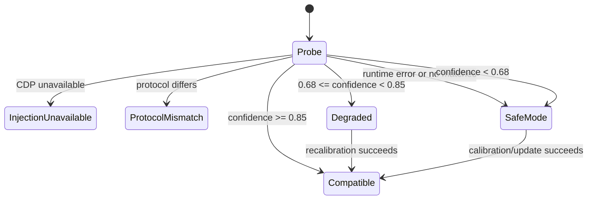

# Compatibility

Compatibility is the project's primary maintenance boundary. The design assumes
that official Desktop versions and their renderer DOM can change.

## Application adapter

An application adapter converts an independently discovered installation into
launch arguments and identity metadata. The initial catalog supports the new
packaged ChatGPT Desktop family and a legacy Codex Desktop family. Candidate
scoring uses running process information, package/uninstall registration,
architecture, publisher/display identity, executable shape, and version.

Store install paths include the application version and can disappear after an
in-place update. Candidates are therefore grouped by stable Package Family
launch identity, ranked by a currently existing executable and newest version,
and resolved again immediately before launch. A failed path check triggers one
fresh discovery attempt rather than retaining the stale version directory.

Adapters do not contain DOM selectors.

## Injection backend

`IInjectionBackend` separates renderer access from the skin engine. Version
`0.3.0-beta.1` uses `CdpInjectionBackend` over a transport-neutral connection.
Private pipe is preferred, while loopback TCP requires explicit consent. If a future official application
removes the remote-debugging capability, MyCO reports injection unavailable;
it does not modify `app.asar` or patch binaries.

Any future backend must preserve the same local-only security boundary and
versioned runtime protocol.

## DOM adapter and matcher

The generic DOM layer uses:

- stable semantic attributes such as roles, author identity, and test/content
  categories;
- ancestor tag/role chains;
- child tag histograms;
- capabilities such as Markdown, code, buttons, and tool surfaces;
- a structural fingerprint containing no text.

Generated tokens with hash-like, numeric, or build-specific shapes are excluded.
No minified CSS class is a required selector.

The current Codex renderer also exposes stable compositional turn shapes:
right-aligned `group/flex/items-end` containers for user turns and
`group/flex/min-w-0` Markdown containers for assistant turns. These strong
signals are evaluated before saved calibration, so an older ambiguous signature
cannot override a current high-confidence role. Calibration remains the fallback.

## Signature

An `ElementSignature` is data, not application-version code. Schema version 1
now contains tag, role, filtered attributes/classes, up to five ancestors,
child-tag shape, capabilities, a sample count, conversation-context
fingerprint, and structural fingerprint. Layout fields remain readable for
backward compatibility but are not used as a saved-coordinate fallback.
Calibration stores separate user and assistant signatures in
`calibration.json`.

The scorer weights stable attributes and element shape more heavily than class
tokens. A competing user/assistant score within `0.08` is ambiguous and remains
unknown. A saved signature is eligible only when it represents at least three
samples and its conversation-context fingerprint matches the current root.

## Capability detection

Target discovery first verifies that a candidate behaves like a page renderer.
The runtime then probes for a conversation root, turn candidates, role matches,
mutation support, installation success, and cleanup support.

While connected, the manager also asks each Runtime to verify that its stylesheet,
observer, and current conversation root are still active. A missing style or an
SPA root replacement is repaired in place; a missing or unhealthy Runtime is
reloaded, and a failed CDP session is removed and reinjected instead of remaining
reported as active.

Application version is diagnostic context. It is not the compatibility decision.

## Windows support and verification matrix

Support is expressed as tested scope, not an unconditional “all Windows users”
claim.

| Surface | Intended support | beta.1 evidence |
| --- | --- | --- |
| Windows 11 x64 | Current supported Windows 11, standard user | Built/tested on Windows 11 Home x64 build 26200; self-contained `win-x64` output |
| Windows 10 x64 | Windows 10 22H2, standard user | Targeted by .NET 8/WPF; not exercised on a Windows 10 host in this run |
| DPI | 100%, 125%, 150%, 200% | WPF layout uses device-independent units; combinations not all visually exercised in this run |
| Windows language/path | English/Chinese; spaces and Chinese characters | Three resource dictionaries tested for key parity; config and Run-command tests include Chinese/spaced paths |
| Manager theme | Dark, Light, Windows System | Pure service/state tests cover all modes and Windows event changes; current-host visual observations are recorded separately |
| Contrast/high-contrast themes | Preserve readable controls and safe fallback | Palette contrast validation is automated; Windows contrast themes were not visually exercised in this run |
| Official Codex state | Installed/not running/running | Launch policy is automated; real-process states are acceptance checks, not inferred from tests |
| Windows ARM64 | No beta.1 release artifact | The installed official package and available hardware are x64. Official ARM64 compatibility was not established by a primary support document or verified device, so `win-arm64` is not published or claimed |

The release remains `win-x64`. A future `win-arm64` artifact requires an
official ARM64 Desktop installation, an ARM64 Windows test device, private-pipe
and Runtime acceptance, Manager/tray/startup checks, and a separate release
build; RID publication alone is not verification.

## Compatibility states

The DOM decorator itself uses a stricter per-element threshold of `0.72`.
Unknown nodes are never modified.

## Safe mode

Safe mode is a successful protective outcome, not permission to guess. MyCO
retains settings and prior signatures, reports diagnostics, and permits
calibration, but skips skin mutation on unknown structures.

## Calibration

Pointer events are captured in the renderer. `event.composedPath()` is inspected
instead of treating a nested text/span target as the whole turn. Semantic turn
containers are preferred; a bounded structural heuristic may climb only to a
legal message wrapper inside a confirmed conversation root. Composer, editor,
navigation, dialog, code, Diff, tool, status, toolbar, control, and
MyCO-created surfaces are rejected.

Each role collects three different message roots. Their stable majority
features form a consensus signature with no coordinates, text, generated
classes, or list indices. Before emitting a result, the rule must match legal
same-role messages in the current conversation at the validation threshold,
including at least one held-out message that was not selected as a sample.
Escape cancels. Old single-sample signatures are invalidated during
configuration load without resetting names, avatars, appearance, language, or
other preferences. No `textContent` is serialized, logged, or fingerprinted.

## Update lifecycle

1. Launch and discover renderer capability.
2. Load the last schema-compatible profile.
3. Run a read-only structural probe.
4. If confidence is high, enable skin automatically.
5. If confidence drops, preserve settings/profile and recommend calibration.
6. If the structure is unknown, remain in safe mode.
7. If the injection boundary changes, publish a backend-compatible MyCO
   release.

Expected recovery:

- small class/wrapper update: automatic matching;
- attribute/context/depth changes: user recalibration;
- medium DOM redesign: MyCO DOM matcher/profile update;
- large renderer or CDP change: MyCO backend release.

Permanent compatibility with every future Desktop update is not promised.

## Regression fixtures

Runtime tests use project-authored synthetic fixtures only. They vary generated
classes, wrappers, attributes, depth, margins/layout, code/tool/status surfaces,
and dynamic mutations. Real application DOM snapshots must never be committed.
